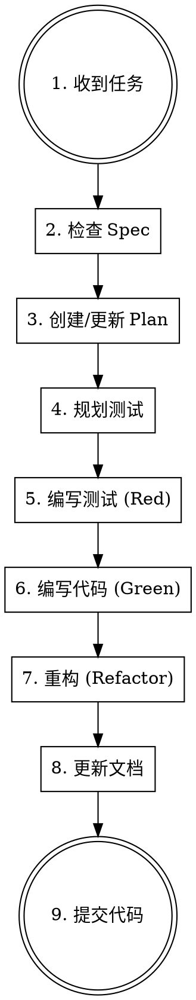

# SSD Development Guide

Synnovator (SSD) 项目的开发规范和最佳实践指南。

## 开发四原则

| 原则 | 规则文件 | 核心要求 |
|------|----------|----------|
| **Spec 先行** | `rules/check-spec.md` | 先确认需求，再写计划，最后实现 |
| **TDD 驱动** | `rules/tdd.md` | Red → Green → Refactor |
| **避免反模式** | `rules/anti-anti-pattern.md` | Django Template, Admin 可配置, Wagtail 模式 |
| **文档更新** | `rules/doc-updater.md` | 代码变更 = 文档变更 |

## 开发流程总览



## 快速检查清单

### 开发前

- [ ] `spec/` 中有对应功能文档？ → 没有则创建
- [ ] `docs/plans/` 中有实施计划？ → 没有则创建
- [ ] 测试计划已确认？ → 写入 plan 文档

### 开发中

- [ ] 使用 Django Template (非 Jinja2)
- [ ] 内容在 Admin 可配置 (非硬编码)
- [ ] Page 用 `add_child()` 创建 (非 `create()`)
- [ ] 列表页用 Index Page (非 Django View)
- [ ] msgid 用英文 (非中文)

### 开发后

- [ ] 所有测试通过 (`uv run pytest`)
- [ ] 更新 `docs/plans/` 标记完成状态
- [ ] 更新 `docs/architecture/` (如有模型变更)
- [ ] 更新 `spec/` (如有需求变更)

## 常用命令

```bash
# 开发服务器
make start

# 运行测试
uv run pytest

# 运行带覆盖率的测试
uv run pytest --cov=synnovator --cov-report=html

# 数据库迁移
uv run python manage.py makemigrations
uv run python manage.py migrate

# 翻译工作流
make translate-ui       # 提取字符串
make compile-translations  # 编译翻译

# 检查反模式
grep -r "{#" templates/ --include="*.html"  # Jinja2 注释
grep -rn "\.objects\.create" synnovator/ --include="*.py" | grep -i "page"  # 直接创建 Page
```

## 项目结构

```
ssd/
├── spec/                    # 功能规格 (业务目的)
│   ├── hackathon-prd.md    # 主 PRD
│   ├── behavior_requirements.csv
│   └── future/             # 未来功能
├── docs/
│   ├── plans/              # 实施计划 (技术方案)
│   ├── architecture/       # 架构文档
│   └── operational/        # 运营文档
├── synnovator/             # Django 应用
│   ├── hackathons/         # Hackathon 功能
│   ├── community/          # 社区功能
│   ├── users/              # 用户系统
│   └── ...
├── templates/              # Django 模板
└── .claude/skills/
    ├── ssd-dev/           # 本 skill
    └── wagtail-builder/   # Wagtail 最佳实践
```

## 规则详情

### Rule 1: Spec 先行 (check-spec)

**顺序**: 目的 (Why) → 计划 (How) → 实现 (What)

```bash
# 检查 spec 是否存在
ls spec/

# 检查 plan 是否存在
ls docs/plans/
```

**See**: `rules/check-spec.md` for templates and examples.

### Rule 2: TDD 驱动 (tdd)

**流程**: 写测试 → 运行失败 → 写代码 → 运行通过 → 重构

```bash
# 运行测试
uv run pytest synnovator/hackathons/tests/ -v

# 覆盖率检查
uv run pytest --cov=synnovator --cov-fail-under=80
```

**See**: `rules/tdd.md` for test templates and patterns.

### Rule 3: 避免反模式 (anti-anti-pattern)

| 检查项 | 检测命令 |
|--------|----------|
| Jinja2 语法 | `grep -r "{#" templates/` |
| 硬编码 URL | `grep -r "http" templates/` |
| 直接创建 Page | `grep -rn "\.objects\.create" synnovator/` |
| 中文 msgid | `grep -rn "_(" synnovator/ \| grep "[\u4e00-\u9fff]"` |

**See**: `rules/anti-anti-pattern.md` for complete list.

### Rule 4: 文档更新 (doc-updater)

| 变更类型 | 更新文档 |
|----------|----------|
| 需求变化 | `spec/` |
| 实施完成 | `docs/plans/` |
| 模型变更 | `docs/architecture/` |
| 新模式/反模式 | `.claude/skills/` |

**See**: `rules/doc-updater.md` for update workflow.

## 与其他 Skill 的关系

| Skill | 用途 | 何时使用 |
|-------|------|----------|
| `wagtail-builder` | Wagtail CMS 开发最佳实践 | 创建 Page/Snippet/API |
| `ssd-dev` (本 skill) | 项目开发规范 | 所有开发任务 |

**使用顺序**:
1. 先用 `ssd-dev` 确认规格和计划
2. 实现时参考 `wagtail-builder` 的技术细节

## 红线警告

以下行为**绝对禁止**:

| 禁止行为 | 原因 | 替代方案 |
|----------|------|----------|
| 跳过 spec 直接编码 | 需求不明确导致返工 | 先写 spec |
| 先写代码后补测试 | 测试覆盖不全 | TDD |
| 使用 `Page.objects.create()` | 破坏 Wagtail 树结构 | `parent.add_child()` |
| 中文作为 msgid | 翻译系统崩溃 | 英文 msgid |
| 代码变更不更新文档 | 文档过时 | 同步更新 |

## 更新本 Skill

如果在开发中发现:
- 新的最佳实践 → 更新对应 rule 文件
- 新的反模式 → 添加到 `rules/anti-anti-pattern.md`
- 流程改进 → 更新 `SKILL.md`

```bash
# Skill 文件位置
ls .claude/skills/ssd-dev/
# SKILL.md
# rules/check-spec.md
# rules/tdd.md
# rules/anti-anti-pattern.md
# rules/doc-updater.md
```

---

**记住**: 遵循规范**就是**最快的开发方式。跳过步骤只会增加返工。
