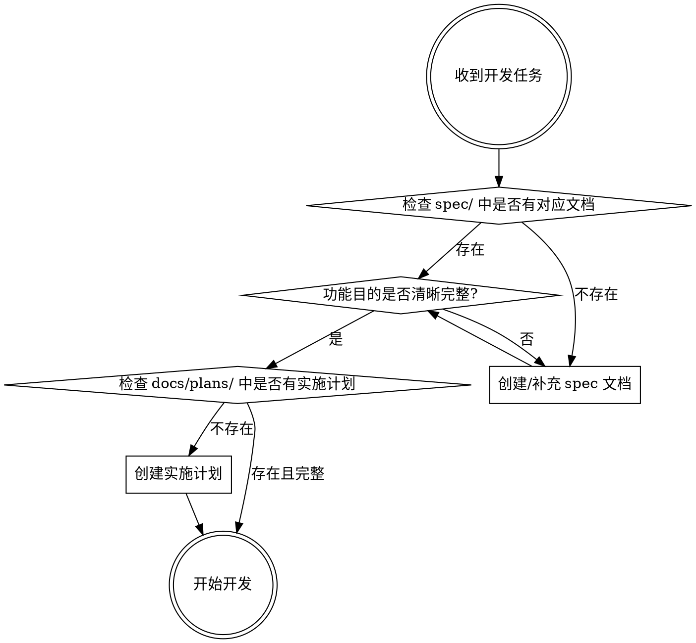

# Rule: Spec First (check-spec)

**开发前必须确认功能规格已在 spec/ 中完整定义**

## Core Principle

```
目的 (Why) ≠ 计划 (How)
```

- **目的 (spec/)**: 业务功能需求，描述"要实现什么"和"为什么需要"
- **计划 (docs/plans/)**: 技术实施方案，描述"如何实现"

**顺序不可逆**: 只有完全确定业务目的后，才能进行技术规划。

## Decision Flow



## Spec 文档要求

### 文件位置与命名

```
spec/
├── hackathon-prd.md           # 主 PRD 文档
├── refactor-for-hackathon.md  # 重构规格
├── behavior_requirements.csv  # 行为需求矩阵
├── future/                    # 未来功能规划
│   └── video-upload.md        # 示例: 视频上传功能
└── simplified-implementation.md
```

### Spec 文档必须包含

1. **业务目的**: 这个功能解决什么问题？
2. **用户故事**: 谁需要这个功能？为什么？
3. **验收标准**: 如何判断功能完成？
4. **边界条件**: 什么不在范围内？

### Spec 文档模板

```markdown
# [功能名称]

## 业务目的

[描述这个功能要解决的核心问题]

## 用户故事

作为 [角色]，我希望 [功能]，以便 [价值]。

## 验收标准

- [ ] 用户可以...
- [ ] 系统应该...
- [ ] 当...时，...

## 边界条件

**不在范围内**:
- ...

## 相关文档

- PRD: spec/hackathon-prd.md
- 实施计划: docs/plans/YYYY-MM-DD-xxx.md
```

## 实施计划要求

### 文件位置与命名

```
docs/plans/
├── 2025-01-22-submission-architecture-redesign.md
├── 2026-01-22-notification-triggers.md
└── YYYY-MM-DD-[feature-name].md  # 日期-功能名
```

### 实施计划必须包含

1. **背景**: 引用对应的 spec 文档
2. **技术方案**: 具体的实现步骤
3. **数据模型**: 涉及的模型变更
4. **测试计划**: 如何验证实现
5. **风险评估**: 可能的问题和缓解措施

### 实施计划模板

```markdown
# [功能名称] Implementation Plan

## Background

Reference: spec/[feature].md

[简述业务需求]

## Technical Approach

### Phase 1: [阶段名]

1. Step 1: ...
2. Step 2: ...

### Phase 2: [阶段名]

...

## Data Model Changes

| Model | Change | Migration |
|-------|--------|-----------|
| ... | ... | ... |

## Test Plan

- Unit tests: ...
- Integration tests: ...

## Risk Assessment

| Risk | Mitigation |
|------|------------|
| ... | ... |

## Checklist

- [ ] Spec reviewed and approved
- [ ] Technical approach validated
- [ ] Test plan confirmed
- [ ] Related tickets created
```

## 检查命令

在开发前运行以下检查:

```bash
# 检查 spec 文件是否存在
ls spec/

# 检查 plans 文件是否存在
ls docs/plans/

# 查找相关的 spec 文档
grep -r "关键词" spec/

# 查看最近的 plans
ls -lt docs/plans/ | head -5
```

## ❌ Anti-Patterns

| 错误做法 | 正确做法 |
|----------|----------|
| 直接开始写代码 | 先确认 spec 和 plan |
| 边做边想需求 | 先完成需求文档 |
| spec 和 plan 混在一起 | 目的和实现分离 |
| 没有验收标准 | 明确定义完成条件 |
| 跳过计划直接实现 | 先规划再动手 |

## 示例

### 任务: "添加视频上传功能"

**Step 1: 检查 spec/**

```bash
ls spec/
# 没有 video-upload.md
```

**Step 2: 创建 spec 文档**

```markdown
# Video Upload Feature

## 业务目的

允许参赛者在提交作品时上传演示视频，帮助评委更好地理解项目。

## 用户故事

作为参赛者，我希望能上传演示视频，以便评委能更直观地了解我的项目。

## 验收标准

- [ ] 用户可以上传 MP4 格式视频，最大 100MB
- [ ] 视频存储在云端 (S3)
- [ ] 评委可以在评审页面播放视频
- [ ] 支持视频预览缩略图

## 边界条件

**不在范围内**:
- 视频编辑功能
- 视频转码
- 直播功能
```

**Step 3: 创建实施计划**

```markdown
# Video Upload Implementation Plan

## Background

Reference: spec/video-upload.md

## Technical Approach

### Phase 1: Model & Storage

1. Create VideoFile model
2. Configure S3 storage
3. Add upload endpoint

### Phase 2: UI Integration

1. Add upload widget to SubmissionPage
2. Create video player component
...
```

**Step 4: 开始开发**

只有在 spec 和 plan 都完成后才开始编码。

## Checklist

开发前确认:

- [ ] `spec/` 中有对应功能的文档
- [ ] 文档包含业务目的和验收标准
- [ ] `docs/plans/` 中有实施计划
- [ ] 实施计划引用了 spec 文档
- [ ] 测试计划已确认
