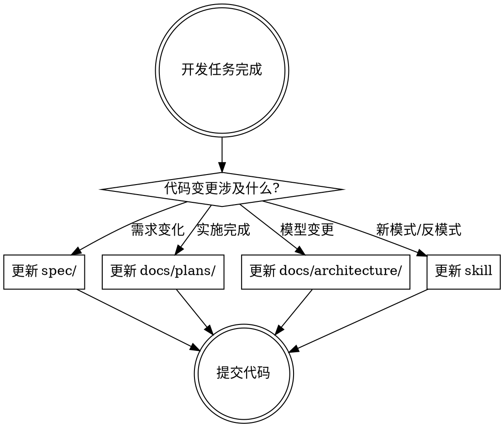
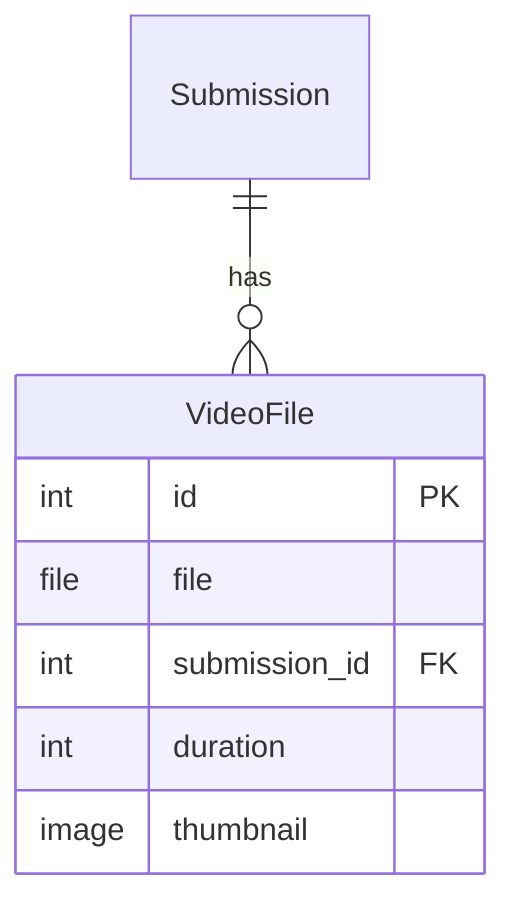

# Rule: Doc Updater

**在开发完成后或确认环节结束后，更新相关文档**

## Core Principle

文档是代码的一部分，不是事后补充的东西。每次开发活动都应该伴随着文档的更新。

```
代码变更 → 文档变更
```

## 需要更新的文档类型

| 文档类型 | 位置 | 更新时机 |
|----------|------|----------|
| Spec (规格) | `spec/` | 需求变更时 |
| Plan (计划) | `docs/plans/` | 实施完成时 |
| Architecture | `docs/architecture/` | 数据模型变更时 |
| Skill | `.claude/skills/` | 发现新模式时 |
| Requirements | `docs/operational/` | 覆盖范围变化时 |

## 更新流程



## 1. Spec 文档更新

### 更新时机

- 需求发生变化
- 发现原需求有歧义
- 添加了新的边界条件
- 验收标准需要调整

### 更新内容

```markdown
# [功能名称]

## 变更记录

| 日期 | 变更内容 | 原因 |
|------|----------|------|
| 2026-01-22 | 添加视频格式限制 | 发现用户上传了不支持的格式 |

## 验收标准 (已更新)

- [x] 用户可以上传 MP4 格式视频 ← 原标准
- [x] 系统拒绝非 MP4 格式并提示用户 ← 新增
```

### 检查命令

```bash
# 查看最近修改的 spec 文件
ls -lt spec/ | head -5

# 查看 spec 文件差异
git diff spec/
```

---

## 2. 实施计划更新

### 更新时机

- 阶段性任务完成
- 实施遇到阻碍
- 发现需要额外步骤
- 风险评估需要调整

### 更新内容

```markdown
# [功能名称] Implementation Plan

## Progress

### Phase 1: Model & Storage ✅ COMPLETED

- [x] Create VideoFile model (2026-01-20)
- [x] Configure S3 storage (2026-01-21)
- [x] Add upload endpoint (2026-01-22)

**Notes**: S3 配置需要额外的 CORS 设置

### Phase 2: UI Integration 🔄 IN PROGRESS

- [x] Add upload widget
- [ ] Create video player component ← 进行中

### Phase 3: Testing 📋 PENDING

- [ ] Unit tests
- [ ] Integration tests

## Issues Encountered

| Issue | Solution | Date |
|-------|----------|------|
| S3 上传超时 | 增加 timeout 配置 | 2026-01-21 |

## Updated Risk Assessment

| Risk | Status | Notes |
|------|--------|-------|
| 大文件上传失败 | 已缓解 | 添加了分片上传 |
| 视频格式不兼容 | 待处理 | 需要添加转码服务 |
```

### 状态标记

```
✅ COMPLETED - 已完成
🔄 IN PROGRESS - 进行中
📋 PENDING - 待开始
❌ BLOCKED - 被阻塞
⏸️ ON HOLD - 暂停
```

---

## 3. 架构文档更新

### 更新时机

- 添加新的数据模型
- 修改模型关系
- 添加新的 API 端点
- 修改系统配置

### 需要更新的文件

```
docs/architecture/
├── data-model-reference.md   # 数据模型文档
├── model-relationships.mmd   # 模型关系图 (Mermaid)
└── api-reference.md          # API 文档
```

### data-model-reference.md 更新

```markdown
## VideoFile (新增 2026-01-22)

| Field | Type | Description |
|-------|------|-------------|
| file | FileField | S3 存储的视频文件 |
| submission | ForeignKey | 关联的 Submission |
| duration | IntegerField | 视频时长 (秒) |
| thumbnail | ImageField | 视频缩略图 |

### 关系

- `Submission` 1:N `VideoFile`

### 索引

- `submission_id` (ForeignKey 自动索引)
```

### model-relationships.mmd 更新



---

## 4. Skill 更新

### 更新时机

- 发现新的最佳实践
- 发现新的反模式
- 工具或框架升级
- 流程改进

### 需要更新的文件

```
.claude/skills/ssd-dev/
├── SKILL.md                  # 主文档
└── rules/
    ├── check-spec.md         # spec 先行规则
    ├── tdd.md                # TDD 规则
    ├── anti-anti-pattern.md  # 反模式规则
    └── doc-updater.md        # 文档更新规则 (本文件)
```

### 更新示例

如果发现了新的反模式:

```markdown
# rules/anti-anti-pattern.md

## Anti-Pattern 7: 新发现的反模式 (新增 2026-01-22)

### ❌ 错误做法

...

### ✅ 正确做法

...

### 检测方法

...
```

---

## 5. 需求覆盖文档更新

### 更新时机

- 完成新功能实现
- 测试覆盖率变化
- 需求优先级变化

### 需要更新的文件

```
docs/operational/
└── requirements-coverage.md
```

### 更新内容

```markdown
# Requirements Coverage

## PRD Requirements

| Requirement | Status | Coverage | Notes |
|-------------|--------|----------|-------|
| Video upload | ✅ Done | 85% | 缺少转码功能 |
| Team formation | 🔄 In Progress | 60% | Phase 2 |
| Verification | 📋 Planned | 0% | Q2 |
```

---

## 文档提交规范

### Commit Message

```bash
# 文档更新应该和代码变更一起提交
git commit -m "feat(video): add video upload feature

- Add VideoFile model
- Configure S3 storage
- Add upload endpoint
- Update docs/architecture/data-model-reference.md
- Update docs/plans/2026-01-22-video-upload.md

Co-Authored-By: Claude Opus 4.5 <noreply@anthropic.com>"
```

### 单独的文档提交

```bash
# 如果只更新文档
git commit -m "docs: update video upload implementation plan

- Mark Phase 1 as completed
- Add notes on S3 CORS configuration
- Update risk assessment"
```

---

## 自动化检查

### Pre-commit Hook (可选)

```bash
#!/bin/bash
# .git/hooks/pre-commit

# 检查是否有代码变更但没有文档更新
CODE_CHANGED=$(git diff --cached --name-only | grep -E "\.py$" | wc -l)
DOCS_CHANGED=$(git diff --cached --name-only | grep -E "^(docs/|spec/)" | wc -l)

if [ $CODE_CHANGED -gt 0 ] && [ $DOCS_CHANGED -eq 0 ]; then
    echo "⚠️  Warning: Code changed but no documentation updated."
    echo "Consider updating:"
    echo "  - docs/plans/ (if implementation changed)"
    echo "  - docs/architecture/ (if models changed)"
    echo "  - spec/ (if requirements changed)"
    echo ""
    echo "Continue anyway? (y/n)"
    read -r response
    if [ "$response" != "y" ]; then
        exit 1
    fi
fi
```

---

## 文档更新 Checklist

每次开发任务完成后:

### 代码相关

- [ ] 如果需求有变化 → 更新 `spec/` 中的相关文档
- [ ] 如果实施有进展 → 更新 `docs/plans/` 中的实施计划
- [ ] 如果模型有变更 → 更新 `docs/architecture/data-model-reference.md`
- [ ] 如果添加了新 API → 更新 API 文档

### 流程相关

- [ ] 如果发现新的最佳实践 → 更新相关 skill
- [ ] 如果发现新的反模式 → 添加到 `anti-anti-pattern.md`
- [ ] 如果流程有改进 → 更新相关规则文档

### 项目管理

- [ ] 如果功能完成 → 更新 `requirements-coverage.md`
- [ ] 如果有风险变化 → 更新实施计划的风险评估

---

## 示例: 完成视频上传功能后的文档更新

### 1. 更新实施计划

```bash
# 编辑 docs/plans/2026-01-22-video-upload.md
# 标记 Phase 1 为完成
```

### 2. 更新架构文档

```bash
# 编辑 docs/architecture/data-model-reference.md
# 添加 VideoFile 模型文档
```

### 3. 更新需求覆盖

```bash
# 编辑 docs/operational/requirements-coverage.md
# 更新视频上传功能状态
```

### 4. 提交变更

```bash
git add synnovator/videos/ docs/ spec/
git commit -m "feat(video): implement video upload

- Add VideoFile model with S3 storage
- Add upload endpoint with size validation
- Update architecture docs
- Mark Phase 1 as completed in plan

Co-Authored-By: Claude Opus 4.5 <noreply@anthropic.com>"
```

---

## 文档质量标准

### 必须包含

- 日期标记 (何时更新)
- 状态标记 (完成/进行中/待定)
- 变更原因 (为什么更新)

### 避免

- 过时的信息
- 重复的内容
- 模糊的描述
- 缺少上下文的变更
