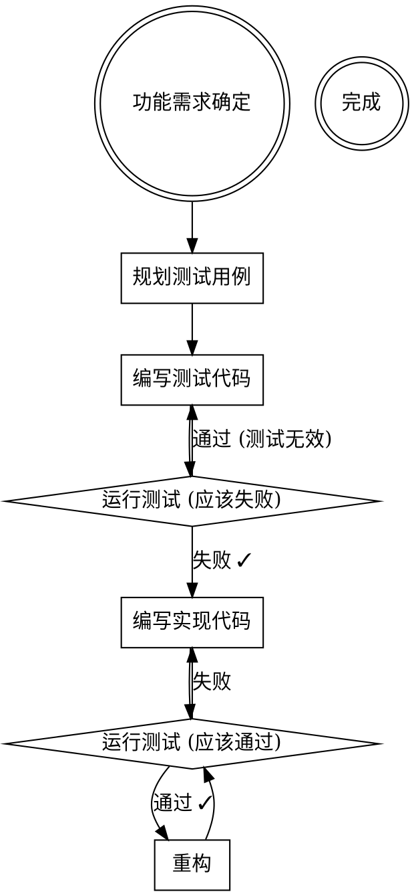

# Rule: Test-Driven Development (TDD)

**在写实现代码前，先规划并确认测试**

## Core Principle

```
Red → Green → Refactor
```

1. **Red**: 先写测试（测试应该失败）
2. **Green**: 写最小代码使测试通过
3. **Refactor**: 重构代码，保持测试通过

## Decision Flow



## 测试分类与优先级

| 测试类型 | 覆盖范围 | 优先级 | 示例 |
|----------|----------|--------|------|
| Unit Test | 单个函数/方法 | ⭐⭐⭐ 高 | Model 方法、工具函数 |
| Integration Test | 多组件交互 | ⭐⭐ 中 | View + Model + Template |
| E2E Test | 完整用户流程 | ⭐ 低 | 用户注册到提交 |

## 测试文件组织

### 推荐结构

```
synnovator/
├── hackathons/
│   ├── models/
│   │   └── hackathon.py
│   ├── views.py
│   └── tests/
│       ├── __init__.py
│       ├── conftest.py         # pytest fixtures
│       ├── factories.py        # Factory Boy factories
│       ├── test_models.py      # Model 测试
│       ├── test_views.py       # View 测试
│       └── test_template_sync.py  # Template-Model 同步测试
```

### conftest.py 模板

```python
import pytest
from wagtail.models import Site
from .factories import HackathonPageFactory, UserFactory


@pytest.fixture
def site():
    """Return the default Wagtail site."""
    return Site.objects.get(is_default_site=True)


@pytest.fixture
def user(db):
    """Create a test user."""
    return UserFactory()


@pytest.fixture
def hackathon_page(site):
    """Create a test hackathon page."""
    return HackathonPageFactory(parent=site.root_page)
```

### factories.py 模板

```python
import factory
from django.contrib.auth import get_user_model
from wagtail.models import Page
from synnovator.hackathons.models import HackathonPage


User = get_user_model()


class UserFactory(factory.django.DjangoModelFactory):
    class Meta:
        model = User

    username = factory.Sequence(lambda n: f"user{n}")
    email = factory.LazyAttribute(lambda obj: f"{obj.username}@example.com")
    password = factory.PostGenerationMethodCall("set_password", "password")


class HackathonPageFactory(factory.django.DjangoModelFactory):
    class Meta:
        model = HackathonPage

    title = factory.Sequence(lambda n: f"Hackathon {n}")
    slug = factory.LazyAttribute(lambda obj: obj.title.lower().replace(" ", "-"))
    depth = 2  # Child of root

    @classmethod
    def _create(cls, model_class, *args, **kwargs):
        parent = kwargs.pop("parent", None)
        if parent:
            return parent.add_child(instance=model_class(*args, **kwargs))
        return super()._create(model_class, *args, **kwargs)
```

## 测试编写指南

### Model 测试

```python
# test_models.py
import pytest
from synnovator.hackathons.models import HackathonPage


@pytest.mark.django_db
class TestHackathonPage:
    """Tests for HackathonPage model."""

    def test_str_returns_title(self, hackathon_page):
        """__str__ should return the page title."""
        assert str(hackathon_page) == hackathon_page.title

    def test_status_field_choices(self):
        """Status field should have correct choices."""
        field = HackathonPage._meta.get_field("status")
        choice_values = [choice[0] for choice in field.choices]
        assert "draft" in choice_values
        assert "published" in choice_values

    def test_get_active_hackathons(self, hackathon_page):
        """get_active_hackathons should return only active events."""
        hackathon_page.status = "active"
        hackathon_page.save()

        active = HackathonPage.get_active_hackathons()
        assert hackathon_page in active
```

### View 测试

```python
# test_views.py
import pytest
from django.urls import reverse


@pytest.mark.django_db
class TestHackathonListView:
    """Tests for hackathon list view."""

    def test_list_view_returns_200(self, client, hackathon_page):
        """List view should return HTTP 200."""
        response = client.get(hackathon_page.url)
        assert response.status_code == 200

    def test_list_view_shows_hackathons(self, client, hackathon_page):
        """List view should display hackathon titles."""
        response = client.get(hackathon_page.url)
        assert hackathon_page.title in response.content.decode()
```

### Template-Model 同步测试

**关键**: 确保 Template 使用的字段与 Model 定义一致。

```python
# test_template_sync.py
import pytest
import re
from pathlib import Path


class TestTemplateModelSync:
    """Verify templates reference valid model fields."""

    @pytest.fixture
    def template_content(self):
        template_path = Path(
            "synnovator/hackathons/templates/hackathons/hackathon_page.html"
        )
        return template_path.read_text()

    def test_hackathon_page_fields(self, template_content):
        """All template fields should exist on HackathonPage model."""
        from synnovator.hackathons.models import HackathonPage

        # Extract {{ page.xxx }} patterns
        field_pattern = r"\{\{\s*page\.(\w+)"
        used_fields = set(re.findall(field_pattern, template_content))

        # Get model fields
        model_fields = {f.name for f in HackathonPage._meta.get_fields()}
        model_fields.update(["title", "url", "slug"])  # Wagtail built-ins

        # Check all used fields exist
        missing = used_fields - model_fields
        assert not missing, f"Template uses undefined fields: {missing}"
```

## 测试命令

```bash
# 运行所有测试
uv run python manage.py test

# 运行特定 app 的测试
uv run python manage.py test synnovator.hackathons

# 运行特定测试类
uv run python manage.py test synnovator.hackathons.tests.test_models.TestHackathonPage

# 使用 pytest (推荐)
uv run pytest

# 运行特定文件
uv run pytest synnovator/hackathons/tests/test_models.py

# 运行带覆盖率
uv run pytest --cov=synnovator --cov-report=html

# 只运行失败的测试
uv run pytest --lf

# 详细输出
uv run pytest -v
```

## ❌ Anti-Patterns

| 错误做法 | 正确做法 |
|----------|----------|
| 先写代码后补测试 | Red-Green-Refactor |
| 测试覆盖率低于 70% | 至少 80% 覆盖率 |
| 测试依赖外部服务 | Mock 外部依赖 |
| 测试之间相互依赖 | 每个测试独立 |
| 测试数据硬编码 | 使用 Factory Boy |
| 跳过失败的测试 | 修复或删除测试 |

## 测试规划模板

在开发前，先填写以下测试规划:

```markdown
# [功能名称] Test Plan

## 测试范围

### Unit Tests

- [ ] Model: `test_xxx_method`
  - 输入: ...
  - 预期输出: ...

- [ ] Utils: `test_xxx_function`
  - 输入: ...
  - 预期输出: ...

### Integration Tests

- [ ] View + Model: `test_xxx_creates_yyy`
  - 前提条件: ...
  - 操作: ...
  - 验证: ...

### Edge Cases

- [ ] 空输入: ...
- [ ] 超长输入: ...
- [ ] 无权限: ...

## 测试数据

### Factories 需要创建

- `XxxFactory`: 字段 a, b, c
- `YyyFactory`: 关联 Xxx

## Mock 需求

- External API: `mock_xxx_service`
- Email: `mock_send_email`
```

## 示例: 添加 "用户注册 Hackathon" 功能

### Step 1: 测试规划

```markdown
# User Registration for Hackathon - Test Plan

## Unit Tests

- [ ] `test_user_can_register_for_hackathon`
- [ ] `test_duplicate_registration_raises_error`
- [ ] `test_registration_closed_raises_error`

## Integration Tests

- [ ] `test_registration_view_creates_participant`
- [ ] `test_registration_sends_confirmation_email`

## Edge Cases

- [ ] 用户已注册同一 Hackathon
- [ ] Hackathon 注册已关闭
- [ ] 用户未登录
```

### Step 2: 编写测试 (Red)

```python
# test_registration.py
import pytest
from synnovator.hackathons.models import HackathonPage, Registration


@pytest.mark.django_db
class TestHackathonRegistration:

    def test_user_can_register_for_hackathon(self, user, hackathon_page):
        """User should be able to register for a hackathon."""
        registration = Registration.objects.create(
            user=user,
            hackathon=hackathon_page,
        )
        assert registration.pk is not None
        assert registration.user == user

    def test_duplicate_registration_raises_error(self, user, hackathon_page):
        """Duplicate registration should raise IntegrityError."""
        Registration.objects.create(user=user, hackathon=hackathon_page)

        with pytest.raises(Exception):  # IntegrityError
            Registration.objects.create(user=user, hackathon=hackathon_page)
```

### Step 3: 运行测试 (应该失败)

```bash
uv run pytest synnovator/hackathons/tests/test_registration.py -v
# Expected: FAILED (Registration model doesn't exist)
```

### Step 4: 编写实现 (Green)

```python
# models/registration.py
from django.db import models
from django.conf import settings


class Registration(models.Model):
    user = models.ForeignKey(
        settings.AUTH_USER_MODEL,
        on_delete=models.CASCADE,
        related_name="hackathon_registrations",
    )
    hackathon = models.ForeignKey(
        "HackathonPage",
        on_delete=models.CASCADE,
        related_name="registrations",
    )
    registered_at = models.DateTimeField(auto_now_add=True)

    class Meta:
        unique_together = ["user", "hackathon"]
```

### Step 5: 运行测试 (应该通过)

```bash
uv run pytest synnovator/hackathons/tests/test_registration.py -v
# Expected: PASSED
```

### Step 6: Refactor (保持测试通过)

## Checklist

开发前确认:

- [ ] 测试计划已写入 docs/plans/ 的实施计划中
- [ ] conftest.py 中有必要的 fixtures
- [ ] factories.py 中有必要的工厂类
- [ ] 测试文件已创建 (即使是空的)

开发后确认:

- [ ] 所有测试通过 (`uv run pytest`)
- [ ] 测试覆盖率 >= 80% (`uv run pytest --cov`)
- [ ] 无跳过的测试 (`@pytest.mark.skip`)
- [ ] Template-Model 同步测试通过
