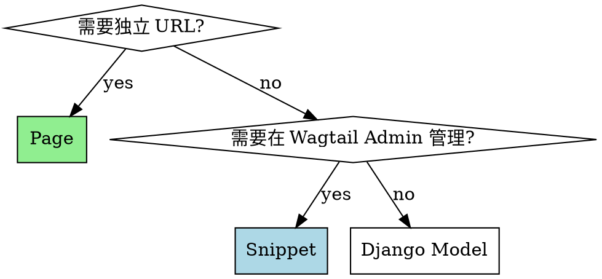
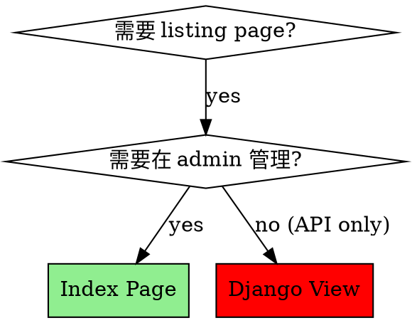

# Wagtail Builder

Wagtail CMS 开发最佳实践指南（Wagtail 6.0+, 7.x, Django 5.x）

## 🚨 Red Flags - STOP and Rethink

这些想法意味着你正在走向错误:

| 想法 | 真相 |
|-----|------|
| "时间紧迫，先快速实现" | 快就是慢。遵循最佳实践**更快** |
| "代码能跑就行" | 能跑 ≠ 能跑得快 ≠ 可维护 |
| "这个功能先不急" | "先不急" = 永远不做 |
| "TableBlock 很方便" | TableBlock 无类型，后续维护成本高 |
| "API 能返回 JSON 就行" | RichText/ImageBlock **必须**配置序列化器 |
| "手写 API 更简单" | Wagtail API v2 功能更完整，开发**更快** |
| "Django view + URLconf 更简单" | 混合路由系统，listing page 无法管理 |
| "翻译留到最后做" | 翻译 = 技术架构的一部分，必须同步 |
| "代码里用中文更方便" | msgid **必须**用英文，否则翻译系统崩溃 |
| "先不管翻译，页面能显示就行" | 不翻译 = 中英文混用 = 用户体验灾难 |
| "Jinja2 语法差不多" | **Django Templates ≠ Jinja2**！注释/条件语法不同 |
| "{# #} 多行注释" | Django 中 `{# #}` 仅限单行，多行用 `` |
| "if 里加括号分组" | Django 不支持 `()`，用嵌套 if 或 view 计算 |

**违反最佳实践不会节省时间，只会增加技术债。**

## Core Decisions

### Decision 1: Page vs Snippet vs Django Model



**Examples**:
- 独立 URL → **Page** (BlogPost, EventPage, ProductPage)
- Listing page with URL → **Index Page** (BlogIndexPage, EventIndexPage)
- 复用数据，无 URL → **Snippet** (Author, Category, Tag)
- 纯数据，无 Wagtail 特性 → **Django Model** (EventParticipant, Order)

### Decision 2: Index Page vs Django View

**For listing pages, ALWAYS use Wagtail Index Page**, never Django view + URLconf.



**Why Index Page?**
- ✅ 在 Wagtail admin 页面树中可见、可管理
- ✅ 编辑可添加 intro、featured items 等内容
- ✅ 内置 SEO 字段（meta description、search image）
- ✅ 统一的 Wagtail 路由，无需手写 URLconf
- ✅ 权限控制通过 Wagtail 权限系统
- ✅ 符合 Wagtail 架构哲学

**Anti-pattern example**:
```python
# ❌ Bad: Django view for listing
# urls.py
urlpatterns = [
    path('events/', views.event_list, name='event_list'),
]

# views.py
def event_list(request):
    events = EventPage.objects.live().public()
    return render(request, 'events/event_list.html', {'events': events})
```

**Problems**:
- ❌ Not visible in Wagtail admin
- ❌ Editors cannot manage content
- ❌ Mixed routing systems (Django + Wagtail)
- ❌ No SEO control

**Correct pattern**:
```python
# ✅ Good: Index Page
class EventIndexPage(Page):
    intro = RichTextField(blank=True)
    featured_event = models.ForeignKey(
        'EventPage',
        null=True,
        blank=True,
        on_delete=models.SET_NULL,
        related_name='+'
    )

    content_panels = Page.content_panels + [
        FieldPanel('intro'),
        FieldPanel('featured_event'),
    ]

    subpage_types = ['events.EventPage']
    max_count = 1

    def get_context(self, request):
        context = super().get_context(request)
        context['events'] = EventPage.objects.live().public()
        return context

class EventPage(Page):
    parent_page_types = ['events.EventIndexPage']
```

**When Django views ARE ok**:
- API endpoints (non-content)
- Form processing
- AJAX requests
- Webhooks

**See**: `references/anti-patterns.md` (Anti-Pattern 7) for detailed comparison.

### Decision 3: Wagtail API v2 vs 手写 API

**永远使用 Wagtail API v2** for Headless projects.

**Why?**
- ✅ 自动分页、搜索、过滤
- ✅ 字段选择 (`?fields=title,author`)
- ✅ 嵌套对象展开
- ✅ 内置缓存机制
- ✅ 维护成本低

**反驳 "时间紧迫"**: 手写 API 看似快，实际更慢:
- 手写: 实现基础功能 2 小时 + 后续添加分页/过滤 4 小时 = 6 小时
- API v2: 配置 30 分钟 + 序列化器 1 小时 = 1.5 小时

See `rules/headless-api.md` for detailed configuration.

## Critical Checklists

### ✅ Headless API Configuration

**CRITICAL**: If your project uses Next.js/React/Vue frontend, you **MUST** configure serializers.

```python
from wagtail.api import APIField
from wagtail.api.v2.serializers import RichTextSerializer

class BlogPost(BasePage):
    body = RichTextField()  # ❌ 未配置序列化器 → API 返回内部格式

    api_fields = [
        # ✅ 正确配置
        APIField('body', serializer=RichTextSerializer()),
    ]
```

**Common mistakes**:
- [ ] RichTextField 未配置 RichTextSerializer → 返回 `<embed>` 标签
- [ ] ImageChooserBlock 未配置 → 只返回 ID，无 URL
- [ ] PageChooserBlock 未配置 → 只返回 ID，无嵌套对象
- [ ] CORS 配置过宽 → 安全风险

**See**: `rules/headless-api.md` for complete guide.

### ⚡ Performance Checklist

**MUST** apply for fields used in `filter()` or `order_by()`:

```python
class EventPage(Page):
    category = models.CharField(
        max_length=50,
        db_index=True,  # ✅ 用于过滤 → 添加索引
    )
    start_date = models.DateField(
        db_index=True,  # ✅ 用于排序 → 添加索引
    )
    description = models.TextField()  # ❌ 只用于展示 → 不需要索引
```

**Query optimization**:
```python
# ❌ N+1 查询
events = EventPage.objects.live()  # 100 events = 101 queries

# ✅ 正确优化
events = EventPage.objects.live().specific()  # 1-2 queries
events = events.select_related('author', 'category')  # JOIN
events = events.prefetch_related('tags')  # 多对多
```

**See**: `rules/data-models.md` for indexing strategy table.

### 📦 StreamField Block Organization

```python
# ❌ Bad: Blocks 在 models.py
class ProductPage(Page):
    content = StreamField([
        ('heading', blocks.CharBlock()),
        ('paragraph', blocks.RichTextBlock()),
        # ... 8 种 blocks 直接定义
    ])

# ✅ Good: 独立 blocks.py
from myapp.blocks import ProductContentBlock

class ProductPage(Page):
    content = StreamField(ProductContentBlock())
```

**Block 数量指南**:
- ✅ 推荐: 5-7 种主 block
- ⚠️ 警告: 8-10 种（接近上限）
- ❌ 禁止: 12+ 种（必须重构）

**Solution**: Use nested StreamBlock or categorize blocks.

**See**: `rules/data-models.md` for atomic design patterns.

### 🌍 Internationalization (i18n) Configuration

**When to use**: Multi-language content management with wagtail-localize.

**Key principles**:
```python
# ✅ Pages: Automatic i18n support
class BlogPage(Page):
    body = RichTextField()
    # No TranslatableMixin needed!

# ✅ Snippets: Require TranslatableMixin
from wagtail.models import TranslatableMixin

@register_snippet
class Author(TranslatableMixin, models.Model):
    name = models.CharField(max_length=255)

    class Meta:
        unique_together = [("translation_key", "locale")]

# ✅ Settings: Also require TranslatableMixin
@register_setting
class SocialSettings(TranslatableMixin, BaseSiteSetting):
    twitter = models.CharField(max_length=255)

    class Meta:
        unique_together = [("translation_key", "locale")]
```

**Common mistakes**:
- [ ] Using TranslatableMixin on Pages (unnecessary, causes conflicts)
- [ ] Missing `unique_together` constraint on Snippets/Settings
- [ ] Wrong INSTALLED_APPS order (wagtail_localize must be before wagtail.contrib.settings)
- [ ] LocaleMiddleware after CommonMiddleware (breaks URL routing)
- [ ] Not migrating existing data before adding TranslatableMixin
- [ ] Using Chinese in msgid (MUST use English as source language)
- [ ] Forgetting to run translation workflow after adding UI components
- [ ] Mixed Chinese/English content in same page context

**See**: `rules/i18n.md` for complete configuration guide.

### 🌐 Translation Workflow (CRITICAL for Multi-language Sites)

**MANDATORY**: After adding ANY UI component (template, form, model label), you MUST follow this workflow.

#### Rule 1: Code MUST Use English as msgid

```python
# ❌ WRONG: Chinese in code
from django.utils.translation import gettext as _

message = _("欢迎")  # NEVER do this
title = _("用户列表")  # msgid is Chinese - translation system breaks

# ✅ CORRECT: English in code
message = _("Welcome")  # msgid is English
title = _("User List")
description = _("Click here to continue")
```

**In templates**:
```django
{# ❌ WRONG: Chinese in msgid #}

这是中文内容

{# ✅ CORRECT: English in msgid #}

This is the content
```

**Why?**: msgid is the **source language** for all translations. Mixing languages breaks the translation key system.

#### Rule 2: Translation Workflow After UI Changes

**MANDATORY checklist after adding/modifying UI components**:

```bash
# Step 1: Extract translatable strings
make translate-ui

# Step 2: Check what changed
git diff locale/zh_Hans/LC_MESSAGES/django.po

# Step 3: Translate new strings
# Edit locale/zh_Hans/LC_MESSAGES/django.po
# Find empty msgstr "" and fill with Chinese translation

# Step 4: Compile translations
make compile-translations

# Step 5: Restart server to see changes
make start
```

**When to run this workflow**:
- ✅ After adding new templates with 
- ✅ After adding form field labels
- ✅ After adding model verbose_name/help_text
- ✅ After adding any _("text") in Python code
- ✅ Before testing UI in Chinese locale
- ✅ Before committing code with new UI text

**Automation approach**:
```python
# Add to your development workflow
# .git/hooks/pre-commit (optional)
#!/bin/bash
make translate-ui
if git diff --exit-code locale/*/LC_MESSAGES/django.po; then
    echo "✓ No new translatable strings"
else
    echo "⚠ New translatable strings found!"
    echo "  Please translate and compile before committing:"
    echo "  1. Edit locale/zh_Hans/LC_MESSAGES/django.po"
    echo "  2. make compile-translations"
    exit 1
fi
```

#### Rule 3: Template Language Consistency

**CRITICAL**: Templates must render in ONE language at a time, never mixed.

```django
{# ❌ WRONG: Mixed Chinese and English #}
<h1>Welcome</h1>
<p>这是欢迎页面</p>  {# Some Chinese #}
<button>Submit</button>  {# Some English #}

{# ✅ CORRECT: All strings marked for translation #}

<h1></h1>
<p></p>
<button></button>
```

**Result**:
- When viewing `/zh-hans/`: 欢迎 / 这是欢迎页面 / 提交
- When viewing `/en/`: Welcome / This is the welcome page / Submit

**Detection method**:
```bash
# Find untranslated Chinese text in templates
grep -r "[\u4e00-\u9fff]" templates/ --include="*.html" \
  | grep -v "{% trans" \
  | grep -v "{% blocktrans"
# Should return EMPTY (all Chinese text wrapped in trans tags)
```

#### Rule 4: Model Verbose Names Must Be English

```python
# ❌ WRONG: Chinese verbose_name without translation
class Event(models.Model):
    title = models.CharField("标题", max_length=200)  # WRONG

    class Meta:
        verbose_name = "活动"  # WRONG
        verbose_name_plural = "活动列表"  # WRONG

# ✅ CORRECT: English verbose_name with translation
from django.utils.translation import gettext_lazy as _

class Event(models.Model):
    title = models.CharField(
        _("Title"),  # Will be translated in admin
        max_length=200,
        help_text=_("Enter event title"),
    )

    class Meta:
        verbose_name = _("Event")
        verbose_name_plural = _("Events")
```

**Why gettext_lazy?**: Model definitions are loaded at import time. Use `gettext_lazy` (or `_`) to defer translation until render time.

#### Rule 5: Translation File Management

**What to commit**:
```bash
# ✅ DO commit
locale/en/LC_MESSAGES/django.po     # English translations (usually empty msgstr)
locale/zh_Hans/LC_MESSAGES/django.po  # Chinese translations (filled msgstr)

# ❌ DON'T commit
locale/*/LC_MESSAGES/django.mo      # Compiled binary (regenerated on server)
locale/django.pot                   # Template file (regenerated each time)
```

**.gitignore**:
```gitignore
# Translation binaries
*.mo

# Translation templates (optional)
locale/django.pot
```

#### Quick Reference: Translation Commands

| Command | Purpose | When to Use |
|---------|---------|-------------|
| `make translate-ui` | Extract UI strings to PO files | After adding any translatable text |
| `make translate-content` | Export Wagtail content | For batch content translation |
| `make compile-translations` | Compile PO → MO files | After editing PO files |
| `make translations` | Extract + Compile in one step | Quick workflow |

#### Testing Translation Quality

**Before committing code with UI changes**:

```bash
# 1. Verify all strings are marked for translation
make translate-ui

# 2. Check no empty translations in Chinese PO file
grep -A 1 'msgid' locale/zh_Hans/LC_MESSAGES/django.po \
  | grep 'msgstr ""$' \
  && echo "⚠ Found untranslated strings!" \
  || echo "✓ All strings translated"

# 3. Compile and test
make compile-translations
make start

# 4. Visual test in both languages
# - Visit http://localhost:8000/zh-hans/ (should be all Chinese)
# - Visit http://localhost:8000/en/ (should be all English)
# - Use language switcher to toggle
```

**Common issues**:
- Translation doesn't appear → Forgot to run `compile-translations`
- Mixed languages → Some strings not wrapped in ``
- English shows in Chinese page → Empty `msgstr` in zh_Hans/django.po
- Chinese shows in English page → Wrong language code in URL

#### Integration with Wagtail Admin

**Wagtail admin interface** will automatically use translated strings for:
- Model verbose names
- Field labels and help text
- Menu items
- Buttons and actions

**Example**:
```python
class EventPage(Page):
    title = models.CharField(
        _("Event Title"),  # Shows as "活动标题" in Chinese admin
        max_length=200,
    )

    content_panels = Page.content_panels + [
        FieldPanel('title'),
        # Panel labels use model field verbose_name automatically
    ]
```

**Result**: When admin user's language preference is Chinese, they see "活动标题" label in the edit form.

**See**: `docs/translation-guide.md` for detailed workflow examples and troubleshooting.

### 🚀 Project Initialization Checklist

**CRITICAL**: After creating models and templates, follow these steps **in order** before starting the dev server.

Missing any step will cause runtime errors that are hard to debug.

#### Step 1: Apply Migrations

```bash
# ❌ Error if skipped:
# django.db.utils.OperationalError: no such table: myapp_mymodel

uv run python manage.py makemigrations
uv run python manage.py migrate

# ✅ Verify: Check migration was applied
uv run python manage.py showmigrations myapp
# Should show [X] for all migrations
```

**Common mistake**: Creating migration files but forgetting to run `migrate`.

#### Step 2: Create Cache Table

```bash
# ❌ Error if skipped:
# django.db.utils.OperationalError: no such table: database_cache

uv run python manage.py createcachetable

# ✅ Verify: Table exists
sqlite3 db.sqlite3 ".tables database_cache"
# Should show: database_cache
```

**When needed**: If `settings.py` uses `django.core.cache.backends.db.DatabaseCache`.

#### Step 3: Create Superuser

```bash
# ❌ Error if skipped:
# "Your username and password didn't match. Please try again."

uv run python manage.py createsuperuser
# Enter: username=admin, password=password (for dev)

# ✅ Verify: Test authentication
uv run python manage.py shell
>>> from django.contrib.auth import authenticate
>>> user = authenticate(username='admin', password='password')
>>> user is not None  # Should be True
```

**Common mistake**: Resetting database but forgetting to recreate superuser.

#### Step 4: Register URL Namespaces

```python
# ❌ Error if skipped:
# django.urls.exceptions.NoReverseMatch: 'myapp' is not a registered namespace

# myapp/urls.py - MUST include app_name
from django.urls import path
from . import views

app_name = 'myapp'  # ✅ Required for 

urlpatterns = [
    path('', views.list_view, name='list'),
]

# Main urls.py - Register the namespace
urlpatterns += [
    path("myapp/", include("myapp.urls")),  # ✅ Includes app_name namespace
]
```

**Detection**: Search templates for `` - each namespace needs `app_name` in its urls.py.

**Verification**:
```python
from django.urls import reverse
reverse('myapp:list')  # Should return URL, not raise NoReverseMatch
```

#### Step 5: Load Initial Data (Optional)

```bash
# For projects with fixture data
uv run python manage.py loaddata initial_data.json

# Or create via management command
uv run python manage.py load_initial_data
```

#### Complete Initialization Script

```bash
# Copy-paste for new Wagtail projects
uv run python manage.py makemigrations
uv run python manage.py migrate
uv run python manage.py createcachetable
uv run python manage.py createsuperuser --username admin --email admin@example.com
uv run python manage.py collectstatic --noinput

# Now safe to start server
uv run python manage.py runserver
```

**Makefile example**:
```makefile
init:
	uv run python manage.py createcachetable
	uv run python manage.py migrate
	uv run python manage.py load_initial_data
	uv run python manage.py collectstatic --noinput

start:
	uv run python manage.py runserver

# Translation workflow
translate-ui:
	@echo "Extracting translatable UI strings..."
	uv run python manage.py makemessages --all --ignore=.venv --ignore=node_modules
	@echo "✓ Edit locale/zh_Hans/LC_MESSAGES/django.po to add translations"

compile-translations:
	@echo "Compiling translation files..."
	uv run python manage.py compilemessages
	@echo "✓ Restart server to see changes"

translations: translate-ui compile-translations
```

#### Step 6: Initialize Translations (Multi-language Sites)

```bash
# ❌ Error if skipped:
# UI shows mixed Chinese/English or no translations

# Generate initial translation files
make translate-ui

# ✅ Verify: PO files exist
ls -la locale/zh_Hans/LC_MESSAGES/django.po
ls -la locale/en/LC_MESSAGES/django.po

# Translate Chinese strings
# Edit locale/zh_Hans/LC_MESSAGES/django.po
# Fill empty msgstr "" with Chinese translations

# Compile translations
make compile-translations

# ✅ Verify: MO files generated
ls -la locale/zh_Hans/LC_MESSAGES/django.mo
```

**When needed**: All multi-language projects using Django i18n.

**Common mistake**: Creating UI components but forgetting to extract/translate/compile.

## Quick Reference

### Model Configuration Template

```python
from wagtail.models import Page
from wagtail.fields import StreamField, RichTextField
from wagtail.admin.panels import FieldPanel
from wagtail.search import index
from wagtail.api import APIField
from wagtail.api.v2.serializers import RichTextSerializer

class ArticlePage(Page):
    # Fields
    author = models.ForeignKey('Author', on_delete=models.PROTECT)
    category = models.CharField(max_length=50, db_index=True)  # ✅ 索引
    publish_date = models.DateField(db_index=True)  # ✅ 索引
    body = RichTextField()

    # Search
    search_fields = Page.search_fields + [
        index.SearchField('body'),
        index.FilterField('category'),
    ]

    # API (for Headless)
    api_fields = [
        APIField('author'),
        APIField('category'),
        APIField('publish_date'),
        APIField('body', serializer=RichTextSerializer()),  # ✅ 序列化器
    ]

    # Admin panels
    content_panels = Page.content_panels + [
        FieldPanel('author'),
        FieldPanel('category'),
        FieldPanel('publish_date'),
        FieldPanel('body'),
    ]
```

### API v2 Setup (30 seconds)

```python
# settings/base.py
INSTALLED_APPS += ['wagtail.api.v2']

# myapp/api.py
from wagtail.api.v2.router import WagtailAPIRouter
from wagtail.api.v2.views import PagesAPIViewSet

api_router = WagtailAPIRouter('wagtailapi')
api_router.register_endpoint('pages', PagesAPIViewSet)

# urls.py
from myapp.api import api_router
urlpatterns += [path('api/v2/', api_router.urls)]
```

**Test**: `http://localhost:8000/api/v2/pages/?fields=*`

## 🔧 Django Template Syntax (NOT Jinja2)

**CRITICAL**: This project uses **Django Templates**, NOT Jinja2. The template engine is configured as:

```python
# settings/base.py
TEMPLATES = [
    {
        "BACKEND": "django.template.backends.django.DjangoTemplates",
        ...
    }
]
```

### Key Differences from Jinja2

| Feature | Django Templates | Jinja2 |
|---------|------------------|--------|
| Multi-line comments | `...` | `{# ... #}` works for multi-line |
| Single-line comments | `{# comment #}` | `{# comment #}` |
| Logical operators | `and`, `or`, `not` (no parentheses) | Supports `()` for grouping |
| extends position | **MUST be first tag** | Can have content before |
| Template loading | `` | Auto-loaded extensions |

### ❌ Anti-Pattern: Wrong Comment Syntax

```django
{# ❌ WRONG: Multi-line with {# #} will render as text #}
{#
    This is a multi-line comment
    that will SHOW ON THE PAGE!
#}

{# ✅ CORRECT: Use  for multi-line #}

    This is a multi-line comment
    that will NOT render on the page


{# ✅ CORRECT: {# #} works for single line only #}
{# This is a single-line comment #}
```

### ❌ Anti-Pattern: extends Not First

```django
{# ❌ WRONG: extends must be FIRST tag #}

    Template documentation here

  {# ERROR: TemplateSyntaxError #}

{# ✅ CORRECT: extends FIRST, then comment #}



    Template documentation here

```

### ❌ Anti-Pattern: Parentheses in Conditions

```django
{# ❌ WRONG: Django doesn't support parentheses for grouping #}


{# ✅ CORRECT: Use nested if statements #}

    
        ...
    


{# ✅ CORRECT: Or restructure logic in view/model #}
{# In view: context['is_actionable'] = (status in ['active', 'pending']) and user.is_authenticated #}

    ...

```

### Quick Reference: Django Template Tags

| Tag | Purpose | Example |
|-----|---------|---------|
| `` | Template inheritance (MUST be first) | `` |
| `` | Define/override blocks | `...` |
| `` | Include another template | `` |
| `` | Load template tag library | `` |
| `` | Multi-line comment | `...` |
| `{# #}` | Single-line comment | `{# This is a comment #}` |
| `` | Conditional | `` |
| `` | Loop | `` |
| `` | Translation (short) | `` |
| `` | Translation (with vars) | `Hello {{ name }}` |
| `` | URL reverse | `` |
| `` | Static file URL | `` |

### Template Debugging Checklist

When you see template errors:

1. **TemplateSyntaxError: extends must be first**
   - Move `` to line 1
   - Put comments AFTER extends and load tags

2. **TemplateSyntaxError: Could not parse remainder**
   - Check for parentheses in `` conditions
   - Check for invalid filter syntax

3. **VariableDoesNotExist**
   - Check field name matches model (e.g., `verification_status` not `status`)
   - Check context variable is passed from view

4. **Comment text showing on page**
   - Change `{# multi-line #}` to `...`

## Common Anti-Patterns

### ❌ Anti-Pattern 1: TableBlock for Structured Data

```python
# ❌ Bad: 无类型的 TableBlock
specifications = StreamField([
    ('specs', TableBlock()),  # 任意内容，无验证
])

# ✅ Good: 类型化 StructBlock
class SpecificationBlock(blocks.StructBlock):
    name = blocks.CharBlock(max_length=50)
    value = blocks.CharBlock(max_length=200)
    unit = blocks.CharBlock(max_length=20, required=False)

specifications = StreamField([
    ('specs', blocks.ListBlock(SpecificationBlock())),
])
```

**When to use TableBlock**: 只用于真正自由格式的表格（如 Markdown 文档中的表格）。

### ❌ Anti-Pattern 2: 忽略时间压力下的最佳实践

```python
# ❌ "时间紧迫"的错误决策
# 1. 跳过索引 → 6 个月后性能问题
# 2. 手写 API → 2 周后需要添加分页，重写
# 3. RichText 不配置序列化器 → 前端说数据格式不对，返工

# ✅ 正确心态
# 遵循最佳实践 **就是** 最快的方式
```

**See**: `references/anti-patterns.md` for complete list with detection methods.

## File Organization

**Recommended structure**:
```
myapp/
├── __init__.py
├── models.py              # Page/Snippet models
├── blocks.py              # Block definitions (or blocks/ directory)
├── api.py                 # API v2 configuration
├── templates/
│   └── myapp/
│       ├── article_page.html
│       └── blocks/        # Block templates
└── tests.py
```

**For large apps** (10+ blocks):
```
myapp/blocks/
├── __init__.py
├── atoms.py       # Basic blocks (~50 lines)
├── molecules.py   # Composite blocks (~100 lines)
└── organisms.py   # Complex blocks (~150 lines)
```

## Testing Your Implementation

After creating models/blocks/API, check:

**Models**:
```bash
# Check for N+1 queries
python manage.py shell
>>> from django.db import connection, reset_queries
>>> reset_queries()
>>> pages = ArticlePage.objects.live()[:10]
>>> [p.title for p in pages]
>>> len(connection.queries)  # Should be ~1-2, not 10+
```

**API**:
```bash
# Test serialization
curl http://localhost:8000/api/v2/pages/123/?fields=body
# Check: RichText 应该是 HTML，不是 <embed> 标签
```

**Indexes**:
```bash
python manage.py sqlmigrate myapp 0001
# Check: 应该看到 CREATE INDEX 语句
```

## When to Use Which Skill Section

- **Creating new Page/Snippet** → Quick Reference + Performance Checklist + Translation Workflow
- **Headless API setup** → Critical Checklists (Headless) + `rules/headless-api.md`
- **StreamField with 5+ blocks** → Block Organization + `rules/data-models.md`
- **Multi-language site (i18n)** → Critical Checklists (i18n) + Translation Workflow + `rules/i18n.md`
- **Adding UI components** → Translation Workflow (MANDATORY)
- **Writing templates** → Django Template Syntax section (CRITICAL: not Jinja2!)
- **Template syntax errors** → Django Template Syntax section + Template Debugging Checklist
- **Code review** → Red Flags + Anti-Patterns + Translation Quality Check + `references/anti-patterns.md`
- **Performance issues** → Performance Checklist + indexing strategy in `rules/data-models.md`
- **Writing tests** → Testing patterns + Factory setup + Template sync tests → `rules/test.md`

## Version Compatibility

- **Wagtail**: 6.0+ (7.x recommended)
- **Django**: 5.x
- **Python**: 3.11+
- **Key changes from 5.x**: ModelAdmin deprecated → use SnippetViewSet

## Further Reading

- `rules/django-templates.md` - **Django template syntax (NOT Jinja2)**, comment rules, conditional logic
- `rules/headless-api.md` - RichText serialization, CORS, preview setup
- `rules/data-models.md` - Indexing strategy, N+1 prevention, Block atomic design
- `rules/i18n.md` - Internationalization with wagtail-localize, TranslatableMixin guide
- `rules/test.md` - pytest testing patterns, Factory Boy, template-model sync tests
- `references/anti-patterns.md` - Common mistakes with detection methods
- `assets/snippets/` - Copy-paste code templates

## Translation Workflow Automation Checklist

Use this checklist **EVERY TIME** you add UI components:

### 📝 Pre-Development Checklist

- [ ] I understand the project uses Chinese (zh-hans) as default language
- [ ] I will use English for all msgid strings in code
- [ ] I have `docs/translation-guide.md` available for reference

### 🛠️ During Development

When adding new UI components:

- [ ] **Templates**: Wrap all display text with `` or ``
  ```django
  {# ✅ CORRECT #}
  
  <h1></h1>
  <p>Hello, {{ user }}!</p>
  ```

- [ ] **Python code**: Use `gettext()` or `_()` for translatable strings
  ```python
  # ✅ CORRECT
  from django.utils.translation import gettext as _
  message = _("Welcome")
  ```

- [ ] **Model fields**: Use `gettext_lazy` for verbose_name and help_text
  ```python
  # ✅ CORRECT
  from django.utils.translation import gettext_lazy as _
  title = models.CharField(_("Title"), max_length=200)
  ```

- [ ] **Forms**: Use `label=_("...")` for form fields
  ```python
  # ✅ CORRECT
  title = forms.CharField(label=_("Title"))
  ```

### ✅ After Adding UI Components

**MANDATORY steps before committing**:

```bash
# 1. Extract new translatable strings
make translate-ui

# 2. Review what changed
git diff locale/zh_Hans/LC_MESSAGES/django.po

# 3. Translate new strings
# Open locale/zh_Hans/LC_MESSAGES/django.po
# Find empty msgstr "" and fill with Chinese

# 4. Compile translations
make compile-translations

# 5. Test in both languages
make start
# Visit http://localhost:8000/zh-hans/ (check Chinese)
# Visit http://localhost:8000/en/ (check English)

# 6. Verify no mixed languages
# Each page should be 100% Chinese OR 100% English
```

### 🔍 Quality Check Before Commit

- [ ] Run `make translate-ui` - no errors
- [ ] All new msgstr in `locale/zh_Hans/LC_MESSAGES/django.po` are filled (no empty `msgstr ""`)
- [ ] Run `make compile-translations` - generates `.mo` files
- [ ] Test `/zh-hans/` URL - all Chinese, no English
- [ ] Test `/en/` URL - all English, no Chinese
- [ ] Language switcher works - toggles between languages
- [ ] No hardcoded Chinese/English text in templates (all wrapped in ``)
- [ ] Git diff shows both `.po` file changes (translation) and code changes

### 🚫 Common Mistakes to Avoid

- [ ] ❌ Using Chinese in msgid: `_("欢迎")` → ✅ Use `_("Welcome")`
- [ ] ❌ Hardcoded text in templates: `<h1>Welcome</h1>` → ✅ `<h1></h1>`
- [ ] ❌ Forgetting to compile: Edit PO but no MO → ✅ Run `make compile-translations`
- [ ] ❌ Not restarting server: Changes not visible → ✅ Restart server after compile
- [ ] ❌ Committing with empty translations: Chinese page shows English → ✅ Fill all msgstr

### 📊 Detection Commands

```bash
# Find hardcoded Chinese in templates (should return empty)
grep -r "[\u4e00-\u9fff]" templates/ --include="*.html" | grep -v "{% trans" | grep -v "{%"

# Find untranslated strings in Chinese PO file
grep -A 1 'msgid' locale/zh_Hans/LC_MESSAGES/django.po | grep 'msgstr ""$'

# Verify MO files exist
ls -la locale/*/LC_MESSAGES/django.mo

# Check translation system is working
uv run python manage.py shell -c "
from django.utils.translation import activate, gettext
activate('zh-hans')
print(gettext('Welcome'))  # Should print Chinese
"
```

## Updating This Skill

**This skill evolves with practice.** If you discover:
- Better practices or new Wagtail features
- New anti-patterns or rationalizations
- Errors or outdated information

**Please update the relevant files**:
- New anti-patterns → `references/anti-patterns.md`
- New best practices → corresponding `rules/*.md` file
- Critical discoveries → `SKILL.md` Red Flags section

See `README.md` for detailed update guidelines.

---

**Remember**:
1. The "quick way" that skips best practices is actually the slow way. Following this guide saves time.
2. **Translation is NOT optional** - it's part of the architecture. Run translation workflow after EVERY UI change.
3. **English in code, Chinese in PO files** - this is the ONLY correct way.
