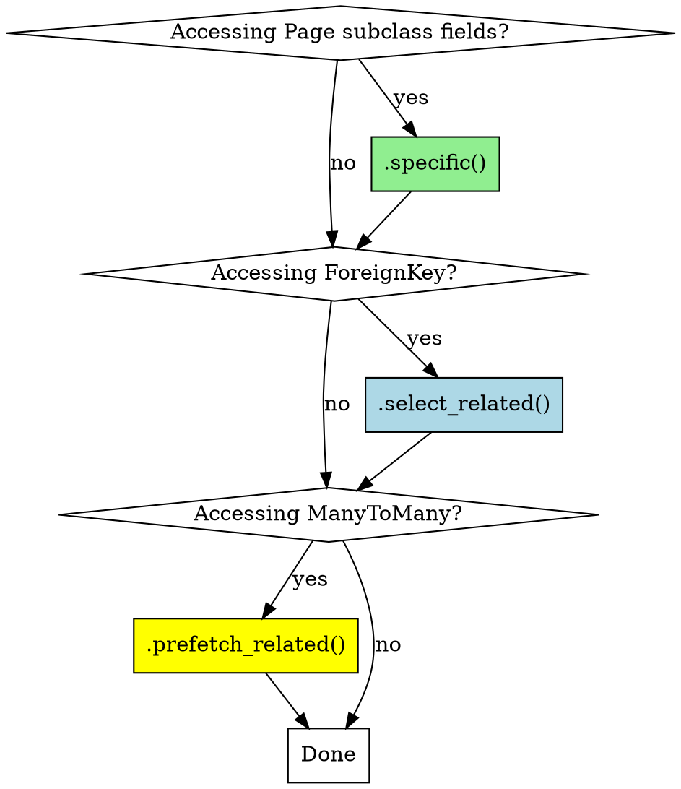

# Data Models and Performance Rules

**For Wagtail 6.0+ Page/Snippet models, StreamField blocks, and query optimization**

## Rule 1: Database Index Strategy

### When to Add `db_index=True`

| Field Usage | Index Needed? | Example |
|-------------|--------------|---------|
| `filter()` queries | ✅ YES | `ArticlePage.objects.filter(category='tech')` |
| `order_by()` queries | ✅ YES | `.order_by('-publish_date')` |
| ForeignKey (automatically indexed) | 🟢 AUTO | `author = models.ForeignKey(Author)` |
| Display only (no queries) | ❌ NO | `description = models.TextField()` |
| SearchField (search_fields) | ⚠️ DIFFERENT | Use `index.SearchField`, NOT `db_index` |

### ❌ Incorrect

```python
class EventPage(Page):
    category = models.CharField(max_length=50)  # ❌ 用于过滤，缺少索引
    start_date = models.DateField()  # ❌ 用于排序，缺少索引
    title = models.CharField(max_length=255, db_index=True)  # ❌ 继承自 Page，已有索引（重复）
    description = models.TextField(db_index=True)  # ❌ 只用于展示，不需要索引

# 模板中过滤

```

**Performance**: 1000 events, 类别过滤 + 排序 = ~2-5 秒（全表扫描）

### ✅ Correct

```python
class EventPage(Page):
    category = models.CharField(
        max_length=50,
        db_index=True,  # ✅ 用于过滤
        choices=CATEGORY_CHOICES,
    )
    start_date = models.DateField(
        db_index=True,  # ✅ 用于排序
    )
    description = models.TextField()  # ✅ 只用于展示，无索引

# View 中过滤（推荐）
events = EventPage.objects.filter(category='hackathon').order_by('-start_date')
```

**Performance**: 1000 events, 类别过滤 + 排序 = ~50-100 ms（索引扫描）

**Speed improvement**: 20-50x faster

### Index Verification

```bash
# Generate migration
python manage.py makemigrations

# Check SQL
python manage.py sqlmigrate myapp 0002

# Should see:
# CREATE INDEX "myapp_eventpage_category_idx" ON "myapp_eventpage" ("category");
# CREATE INDEX "myapp_eventpage_start_date_idx" ON "myapp_eventpage" ("start_date");
```

### SearchField vs db_index

```python
class ArticlePage(Page):
    category = models.CharField(max_length=50, db_index=True)  # ✅ 过滤用

    search_fields = Page.search_fields + [
        index.SearchField('title'),  # ✅ 全文搜索
        index.SearchField('body'),   # ✅ 全文搜索
        index.FilterField('category'),  # ✅ 精确匹配过滤（不是全文搜索）
    ]
```

**Key difference**:
- `db_index=True` → 数据库索引（用于 SQL `WHERE category = 'tech'`）
- `index.SearchField` → Wagtail 搜索索引（用于 `.search('keyword')`）
- `index.FilterField` → 两者都用（数据库索引 + 搜索过滤）

---

## Rule 2: N+1 Query Prevention

### The Problem

```python
# View
class NewsListingPage(Page):
    def get_context(self, request):
        context = super().get_context(request)
        # ❌ N+1 query: 100 articles = 101 queries
        articles = ArticlePage.objects.live()
        context['articles'] = articles
        return context

# Template

    <h2>{{ article.title }}</h2>
    <p>By {{ article.author.name }}</p>  {# ← Query per article #}
      {# ← Query per article #}

```

**Performance**: 100 articles = 101 queries (~2-5 seconds)

### ✅ Solution: `.specific()` + `select_related()` + `prefetch_related()`

```python
class NewsListingPage(Page):
    def get_context(self, request):
        context = super().get_context(request)
        # ✅ Optimized: 100 articles = 1-2 queries
        articles = (
            ArticlePage.objects.live()
            .specific()  # ✅ Fetch concrete Page types
            .select_related('author', 'listing_image')  # ✅ JOIN ForeignKey
            .prefetch_related('tags')  # ✅ Separate query for ManyToMany
        )
        context['articles'] = articles
        return context
```

**Performance**: 100 articles = 1-2 queries (~50-100 ms)

**Speed improvement**: 20-50x faster

### Decision Tree: Which to Use?



### Comprehensive Example

```python
# ❌ Bad: Multiple N+1 issues
events = EventPage.objects.live()
for event in events:
    print(event.category)  # ❌ Extra query per event (.specific() missing)
    print(event.author.name)  # ❌ Extra query per event (FK)
    print([tag.name for tag in event.tags.all()])  # ❌ Extra query per event (M2M)

# ✅ Good: All optimized
events = (
    EventPage.objects.live()
    .specific()  # ✅ Category field is in EventPage, not Page
    .select_related('author')  # ✅ JOIN author table
    .prefetch_related('tags')  # ✅ Separate query for all tags at once
)
for event in events:
    print(event.category)  # ✅ No extra query
    print(event.author.name)  # ✅ No extra query
    print([tag.name for tag in event.tags.all()])  # ✅ No extra query
```

### Testing for N+1 Queries

```python
# In Django shell or test
from django.db import connection, reset_queries
from django.test.utils import override_settings

@override_settings(DEBUG=True)
def test_no_n_plus_one():
    reset_queries()

    # Your query
    pages = ArticlePage.objects.live().specific().select_related('author')
    list(pages)  # Force evaluation

    # Check query count
    print(f"Queries: {len(connection.queries)}")
    for query in connection.queries:
        print(query['sql'])

    # Should be ~1-2 queries, not N+1
    assert len(connection.queries) <= 3, f"Too many queries: {len(connection.queries)}"
```

---

## Rule 3: StreamField Block Organization

### Block Count Guidelines

| Block Count | Status | Action |
|-------------|--------|--------|
| 1-5 blocks | ✅ Optimal | Keep as is |
| 6-7 blocks | ✅ Good | Acceptable |
| 8-10 blocks | ⚠️ Warning | Consider refactoring |
| 11+ blocks | ❌ Too many | MUST refactor |

### ❌ Incorrect: StreamField Soup

```python
# models.py
class ProductPage(Page):
    content = StreamField([
        ('heading', blocks.CharBlock()),
        ('paragraph', blocks.RichTextBlock()),
        ('image', ImageChooserBlock()),
        ('quote', blocks.BlockQuoteBlock()),
        ('video', EmbedBlock()),
        ('cta_button', CTAButtonBlock()),
        ('testimonial', TestimonialBlock()),
        ('faq', FAQBlock()),
        ('pricing_table', PricingTableBlock()),
        ('team_member', TeamMemberBlock()),
        ('gallery', GalleryBlock()),
        ('map', MapBlock()),
        # ❌ 12 block types!
    ])
```

**Problems**:
- Overwhelming editor UI (12 options)
- Difficult to maintain
- Hard to understand semantic structure
- No reusability across pages

### ✅ Correct: Organized Blocks in Separate File

```python
# products/blocks.py
from wagtail import blocks

# Atomic blocks (basic elements)
class HeadingBlock(blocks.CharBlock):
    class Meta:
        icon = 'title'
        template = 'blocks/heading.html'

class ParagraphBlock(blocks.RichTextBlock):
    class Meta:
        icon = 'pilcrow'
        template = 'blocks/paragraph.html'

# Molecular blocks (combinations)
class IntroSectionBlock(blocks.StructBlock):
    heading = HeadingBlock()
    text = ParagraphBlock()
    image = ImageChooserBlock(required=False)

    class Meta:
        icon = 'doc-full'
        template = 'blocks/intro_section.html'

# Organism blocks (complex sections)
class ContentBlock(blocks.StreamBlock):
    intro = IntroSectionBlock()
    features = FeaturesBlock()
    testimonials = TestimonialsBlock()
    cta = CTABlock()

# models.py
from products.blocks import ContentBlock

class ProductPage(Page):
    content = StreamField(ContentBlock())  # ✅ Only 4 top-level blocks
```

**Benefits**:
- Cleaner editor UI (4 semantic sections vs 12 options)
- Reusable across multiple page types
- Easier to maintain
- Clear hierarchy

### File Structure for Large Apps

```
myapp/blocks/
├── __init__.py          # Export all blocks
├── atoms.py             # Basic blocks (~50 lines)
│   ├── HeadingBlock
│   ├── ParagraphBlock
│   └── ImageBlock
├── molecules.py         # Composite blocks (~100 lines)
│   ├── IntroSectionBlock
│   ├── CTABlock
│   └── TestimonialBlock
└── organisms.py         # Complex blocks (~150 lines)
    ├── HeroSectionBlock
    ├── FeaturesGridBlock
    └── ContentStreamBlock
```

**Size guidelines**:
- atoms.py: ~50-80 lines
- molecules.py: ~100-150 lines
- organisms.py: ~150-200 lines
- Total: ~300-400 lines (vs 400+ in single file)

---

## Rule 4: Typed StructBlock vs Generic TableBlock

### ❌ Incorrect: Generic TableBlock

```python
class ProductPage(Page):
    specifications = StreamField([
        ('specs', TableBlock()),  # ❌ Untyped, any content
    ])
```

**Problems**:
- No validation (can enter text in "Price" column)
- No semantic meaning (frontend doesn't know what "Column 2" is)
- No structured search (can't query "all products with 16GB RAM")
- API returns 2D array, frontend must parse

**When to use TableBlock**: Only for truly free-form content (like Markdown tables)

### ✅ Correct: Typed StructBlock

```python
class SpecificationBlock(blocks.StructBlock):
    name = blocks.CharBlock(max_length=50, help_text="Spec name (e.g., 'Processor')")
    value = blocks.CharBlock(max_length=200, help_text="Spec value (e.g., 'Intel i7')")
    unit = blocks.CharBlock(max_length=20, required=False, help_text="Unit (e.g., 'GB', 'GHz')")

    class Meta:
        icon = 'list-ul'

class ProductPage(Page):
    specifications = StreamField([
        ('specs', blocks.ListBlock(SpecificationBlock())),
    ])
```

**Benefits**:
- ✅ Validation (max_length enforced)
- ✅ Semantic (name/value/unit clear)
- ✅ Searchable (can query products by specs)
- ✅ API returns structured JSON

---

## Rule 5: Block Business Logic with `get_context`

### ❌ Incorrect: Logic in Template

```python
# blocks.py
class FeaturesBlock(blocks.StructBlock):
    features = blocks.ListBlock(FeatureBlock())
    layout = blocks.ChoiceBlock(choices=[('grid-2', '2 columns'), ('grid-3', '3 columns')])

# template

    <div class="grid grid-cols-2">

    <div class="grid grid-cols-3">

```

**Problems**:
- Business logic in template (violates MVC)
- Hard to test
- Difficult to reuse

### ✅ Correct: Logic in Block

```python
class FeaturesBlock(blocks.StructBlock):
    features = blocks.ListBlock(FeatureBlock())
    layout = blocks.ChoiceBlock(choices=[('grid-2', '2 columns'), ('grid-3', '3 columns')])

    def get_context(self, value, parent_context=None):
        context = super().get_context(value, parent_context)

        # Business logic
        context['feature_count'] = len(value['features'])
        context['layout_class'] = {
            'grid-2': 'grid grid-cols-2 gap-4',
            'grid-3': 'grid grid-cols-3 gap-4',
        }.get(value['layout'], '')

        return context

    class Meta:
        template = 'blocks/features.html'

# template (simplified)
<div class="{{ layout_class }}">
    
        ...
    
</div>
```

**Benefits**:
- ✅ Testable (unit test the method)
- ✅ Reusable (DRY principle)
- ✅ Clear separation of concerns

---

## Rule 6: SnippetViewSet (Wagtail 6.0+)

**ModelAdmin is deprecated.** Use SnippetViewSet.

### Migration Example

```python
# ❌ Old (Wagtail 5.x)
from wagtail.contrib.modeladmin.options import ModelAdmin, modeladmin_register

class CategoryAdmin(ModelAdmin):
    model = Category
    menu_label = 'Categories'
    menu_icon = 'folder-open-inverse'
    list_display = ('name', 'product_count')

    def product_count(self, obj):
        return obj.products.count()

modeladmin_register(CategoryAdmin)

# ✅ New (Wagtail 6.0+)
from wagtail.snippets.views.snippets import SnippetViewSet
from wagtail.snippets.models import register_snippet

class CategoryViewSet(SnippetViewSet):
    model = Category
    menu_label = 'Categories'
    icon = 'folder-open-inverse'  # Changed from menu_icon
    list_display = ['name', 'product_count']

    def product_count(self, obj):
        return obj.products.count()
    product_count.short_description = 'Products'

register_snippet(CategoryViewSet)
```

**Key changes**:
- `menu_icon` → `icon`
- `list_display` tuple → list
- `modeladmin_register()` → `register_snippet()`

---

## Complete Model Checklist

When creating a new Page/Snippet model:

**Fields**:
- [ ] Add `db_index=True` for fields used in `filter()` or `order_by()`
- [ ] Use ForeignKey for related data (not CharField)
- [ ] Add `help_text` to all fields

**Search**:
- [ ] Configure `search_fields` (SearchField for full-text, FilterField for exact match)
- [ ] Use `index.FilterField` for fields that need both DB index and search filtering

**API (if Headless)**:
- [ ] Configure `api_fields`
- [ ] RichTextField with RichTextSerializer
- [ ] ImageChooserBlock with custom serializer
- [ ] PageChooserBlock with nested expansion

**Performance**:
- [ ] Use `.specific()` when accessing subclass fields
- [ ] Use `.select_related()` for ForeignKey
- [ ] Use `.prefetch_related()` for ManyToMany
- [ ] Test with 100+ objects to verify no N+1 queries

**Blocks** (if using StreamField):
- [ ] Blocks in separate file (not models.py)
- [ ] Use StructBlock (not generic TableBlock)
- [ ] Add `get_context` for business logic
- [ ] Limit to 5-8 top-level block types

---

## Testing Your Models

```python
# Test 1: Check indexes
python manage.py sqlmigrate myapp 0001 | grep "CREATE INDEX"

# Test 2: Check N+1 queries
from django.test.utils import override_settings
from django.db import connection

@override_settings(DEBUG=True)
def test_listing_page():
    connection.queries_log.clear()
    response = client.get('/news/')
    num_queries = len(connection.queries)
    assert num_queries <= 5, f"Too many queries: {num_queries}"

# Test 3: Check API serialization
response = client.get('/api/v2/pages/123/?fields=body')
assert '<embed' not in response.json()['body'], "RichText not serialized"
```

---

## Summary

**5 Critical Rules**:
1. Add `db_index=True` to fields used in `filter()`/`order_by()`
2. Use `.specific()` + `.select_related()` + `.prefetch_related()` to prevent N+1
3. Organize blocks in separate file, limit to 5-8 top-level types
4. Use typed StructBlock, not generic TableBlock
5. Put business logic in `get_context`, not templates

**Performance impact**: 20-50x faster queries

**See also**:
- `../assets/snippets/base-page-model.py` - Template with all optimizations
- `../assets/checklists/page-model-checklist.md` - Complete verification list
