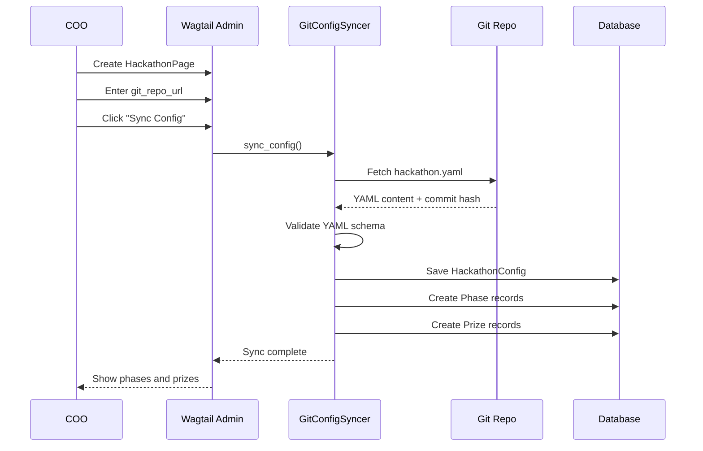

# Synnovator Hackathon Platform Refactoring Specification

## Document Overview

This comprehensive specification document serves as the implementation guide for transforming the Wagtail news template into a full-featured AI hackathon platform implementing "Events as Code" architecture as specified in spec/hackathon-prd.md.

**Document Version:** 1.0
**Last Updated:** 2026-01-20
**Target Completion:** Week 20

---

## Section 1: Data Structure Mapping

### 1.1 Page Model Transformations

| Old Structure | New Structure | Action | Rationale |
|--------------|---------------|--------|-----------|
| `ArticlePage` | `AnnouncementPage` | Keep/Rename | Platform updates and news still needed |
| `NewsListingPage` | `AnnouncementListingPage` | Keep/Rename | Landing page for announcements |
| `EventPage` | `HackathonPage` | Extend | Add Git config, phases, prizes, verification |
| `EventListingPage` | `HackathonListingPage` | Extend | Add filtering by status, phase |
| `EventParticipant` (if exists) | `TeamMember` | Transform | Enhance with contribution tracking |

### 1.2 New Model Entities

| Model | Purpose | Key Relationships |
|-------|---------|-------------------|
| `HackathonPage` | Wagtail page for hackathon details | Extends Page, has HackathonConfig |
| `HackathonConfig` | Parsed YAML configuration | OneToOne with HackathonPage |
| `Team` | Represents hackathon team | FK to HackathonPage, M2M to User |
| `TeamMember` | Through model for team membership | FK to Team and User |
| `Quest` | Dojo challenge | Can be standalone or hackathon-specific |
| `Submission` | Code submission | Polymorphic (quest or final submission) |
| `VerificationLog` | Webhook audit trail | FK to Submission |
| `Phase` | Hackathon timeline phase | FK to HackathonConfig |
| `Prize` | Award configuration | FK to HackathonConfig |

### 1.3 User Model Extensions

| Field | Type | Purpose |
|-------|------|---------|
| `github_username` | CharField | OAuth integration, Git verification |
| `gitlab_username` | CharField | Multi-provider support |
| `preferred_role` | CharField | Hacker/Hipster/Hustler/Mentor |
| `skills` | JSONField | Skill tags for matching |
| `xp_points` | IntegerField | Gamification |
| `reputation_score` | DecimalField | Quality metric |
| `profile_completed` | BooleanField | Onboarding flag |

### 1.4 Data Migration Mapping

| Source | Destination | Transformation Logic |
|--------|-------------|---------------------|
| `EventPage` (category='hackathon') | `HackathonPage` | Convert, set status='archived' |
| `EventPage` (other categories) | Keep as `EventPage` | No change (workshops, meetups) |
| `EventParticipant` records | `Team` + `TeamMember` | Group by team_name, preserve role |
| Existing `User` records | Extended `User` | Add fields with defaults, prompt profile completion |

---

## Section 2: Database Schema Design

### 2.1 HackathonPage Model

```python
from wagtail.models import Page
from wagtail.fields import RichTextField, StreamField
from wagtail.admin.panels import FieldPanel, MultiFieldPanel
from django.db import models
from django.conf import settings

class HackathonPage(Page):
    """
    Wagtail page model for hackathon events.
    Extends base Page with hackathon-specific fields and Git integration.
    """

    # Basic Information
    description = RichTextField(
        blank=True,
        help_text="Brief description of the hackathon"
    )

    cover_image = models.ForeignKey(
        'wagtailimages.Image',
        null=True,
        blank=True,
        on_delete=models.SET_NULL,
        related_name='+'
    )

    # Git Configuration
    git_repo_url = models.URLField(
        max_length=500,
        help_text="URL to Git repository containing hackathon.yaml configuration"
    )

    git_branch = models.CharField(
        max_length=100,
        default='main',
        help_text="Branch to sync configuration from"
    )

    last_sync_at = models.DateTimeField(
        null=True,
        blank=True,
        help_text="Last successful configuration sync timestamp"
    )

    last_sync_commit = models.CharField(
        max_length=40,
        blank=True,
        help_text="Git commit hash of last sync"
    )

    sync_status = models.CharField(
        max_length=20,
        choices=[
            ('pending', 'Pending'),
            ('syncing', 'Syncing'),
            ('success', 'Success'),
            ('error', 'Error'),
        ],
        default='pending'
    )

    sync_error_message = models.TextField(
        blank=True,
        help_text="Error message from last sync attempt"
    )

    # Team Configuration
    min_team_size = models.PositiveIntegerField(
        default=2,
        help_text="Minimum number of team members"
    )

    max_team_size = models.PositiveIntegerField(
        default=5,
        help_text="Maximum number of team members"
    )

    allow_solo = models.BooleanField(
        default=False,
        help_text="Allow individual participants without teams"
    )

    required_roles = models.JSONField(
        default=list,
        blank=True,
        help_text="List of required roles for team composition"
    )

    # Verification Settings
    verification_provider = models.CharField(
        max_length=50,
        choices=[
            ('github_actions', 'GitHub Actions'),
            ('gitlab_ci', 'GitLab CI'),
            ('custom', 'Custom Webhook'),
        ],
        default='github_actions'
    )

    webhook_secret = models.CharField(
        max_length=255,
        blank=True,
        help_text="Secret for HMAC signature verification (encrypted in production)"
    )

    passing_score = models.DecimalField(
        max_digits=5,
        decimal_places=2,
        default=80.0,
        help_text="Minimum score required for quest completion"
    )

    # Status and Visibility
    status = models.CharField(
        max_length=20,
        choices=[
            ('draft', 'Draft'),
            ('upcoming', 'Upcoming'),
            ('registration_open', 'Registration Open'),
            ('in_progress', 'In Progress'),
            ('judging', 'Judging'),
            ('completed', 'Completed'),
            ('archived', 'Archived'),
        ],
        default='draft'
    )

    # StreamField for flexible content
    body = StreamField([
        # Import from synnovator.utils.blocks
    ], blank=True, use_json_field=True)

    # Panels for Wagtail Admin
    content_panels = Page.content_panels + [
        FieldPanel('description'),
        FieldPanel('cover_image'),
        FieldPanel('body'),
        MultiFieldPanel([
            FieldPanel('git_repo_url'),
            FieldPanel('git_branch'),
            FieldPanel('last_sync_at', read_only=True),
            FieldPanel('last_sync_commit', read_only=True),
            FieldPanel('sync_status', read_only=True),
            FieldPanel('sync_error_message', read_only=True),
        ], heading="Git Configuration"),
        MultiFieldPanel([
            FieldPanel('min_team_size'),
            FieldPanel('max_team_size'),
            FieldPanel('allow_solo'),
            FieldPanel('required_roles'),
        ], heading="Team Settings"),
        MultiFieldPanel([
            FieldPanel('verification_provider'),
            FieldPanel('webhook_secret'),
            FieldPanel('passing_score'),
        ], heading="Verification Settings"),
        FieldPanel('status'),
    ]

    class Meta:
        verbose_name = "Hackathon"
        verbose_name_plural = "Hackathons"

    def sync_config(self):
        """Trigger configuration sync from Git repository"""
        from .config_sync import GitConfigSyncer
        syncer = GitConfigSyncer(self)
        return syncer.sync()

    def get_current_phase(self):
        """Get current active phase based on datetime"""
        from django.utils import timezone
        now = timezone.now()
        try:
            return self.config.phases.filter(
                start_date__lte=now,
                end_date__gte=now
            ).first()
        except:
            return None

    def get_leaderboard(self, limit=10):
        """Get top teams ordered by score"""
        return self.teams.filter(
            submission__verification_status='passed'
        ).order_by('-final_score')[:limit]
```

### 2.2 HackathonConfig Model

```python
from django.db import models
from django.contrib.postgres.fields import JSONField

class HackathonConfig(models.Model):
    """
    Stores parsed YAML configuration from Git repository.
    OneToOne relationship with HackathonPage.
    """

    hackathon = models.OneToOneField(
        'HackathonPage',
        on_delete=models.CASCADE,
        related_name='config'
    )

    # Raw YAML storage
    raw_yaml = models.TextField(
        help_text="Complete YAML file content"
    )

    parsed_config = models.JSONField(
        default=dict,
        help_text="Parsed YAML as JSON"
    )

    # Git metadata
    git_commit_hash = models.CharField(
        max_length=40,
        help_text="Commit hash when config was fetched"
    )

    git_commit_message = models.TextField(
        blank=True,
        help_text="Commit message for audit trail"
    )

    git_committed_at = models.DateTimeField(
        null=True,
        blank=True,
        help_text="Commit timestamp"
    )

    # Validation
    schema_version = models.CharField(
        max_length=10,
        default='1.0',
        help_text="YAML schema version"
    )

    is_valid = models.BooleanField(
        default=True,
        help_text="Configuration passed validation"
    )

    validation_errors = models.JSONField(
        default=list,
        blank=True,
        help_text="List of validation errors if any"
    )

    # Timestamps
    created_at = models.DateTimeField(auto_now_add=True)
    updated_at = models.DateTimeField(auto_now=True)

    class Meta:
        verbose_name = "Hackathon Configuration"
        ordering = ['-updated_at']

    def __str__(self):
        return f"Config for {self.hackathon.title} ({self.git_commit_hash[:7]})"
```

### 2.3 Phase Model

```python
from django.db import models

class Phase(models.Model):
    """
    Represents a timeline phase within a hackathon.
    Examples: Registration, Team Formation, Hacking, Judging, Awards
    """

    config = models.ForeignKey(
        'HackathonConfig',
        on_delete=models.CASCADE,
        related_name='phases'
    )

    phase_id = models.CharField(
        max_length=50,
        help_text="Unique identifier from YAML (e.g., 'registration', 'hacking')"
    )

    title = models.CharField(
        max_length=200,
        help_text="Display name for phase"
    )

    description = models.TextField(
        blank=True,
        help_text="Phase description and objectives"
    )

    start_date = models.DateTimeField(
        help_text="Phase start datetime (UTC)"
    )

    end_date = models.DateTimeField(
        help_text="Phase end datetime (UTC)"
    )

    order = models.PositiveIntegerField(
        default=0,
        help_text="Display order"
    )

    requirements = models.JSONField(
        default=dict,
        blank=True,
        help_text="Phase-specific requirements (e.g., min team size, submission format)"
    )

    class Meta:
        ordering = ['order', 'start_date']
        unique_together = [['config', 'phase_id']]

    def __str__(self):
        return f"{self.title} ({self.start_date.strftime('%Y-%m-%d')})"

    def is_active(self):
        from django.utils import timezone
        now = timezone.now()
        return self.start_date <= now <= self.end_date
```

### 2.4 Prize Model

```python
from django.db import models

class Prize(models.Model):
    """
    Represents awards and prizes for hackathon winners.
    """

    config = models.ForeignKey(
        'HackathonConfig',
        on_delete=models.CASCADE,
        related_name='prizes'
    )

    prize_id = models.CharField(
        max_length=50,
        help_text="Unique identifier from YAML (e.g., 'first_place', 'best_ai')"
    )

    title = models.CharField(
        max_length=200,
        help_text="Prize name"
    )

    description = models.TextField(
        blank=True,
        help_text="Prize details"
    )

    rank = models.PositiveIntegerField(
        default=1,
        help_text="Ranking (1 = first place)"
    )

    monetary_value = models.DecimalField(
        max_digits=10,
        decimal_places=2,
        null=True,
        blank=True,
        help_text="Cash value in USD"
    )

    benefits = models.JSONField(
        default=list,
        blank=True,
        help_text="Non-monetary benefits (e.g., incubation, mentorship)"
    )

    award_criteria = models.TextField(
        blank=True,
        help_text="How winner is determined"
    )

    awarded_to = models.ForeignKey(
        'Team',
        null=True,
        blank=True,
        on_delete=models.SET_NULL,
        related_name='prizes_won',
        help_text="Winning team (set after judging)"
    )

    class Meta:
        ordering = ['rank']
        unique_together = [['config', 'prize_id']]

    def __str__(self):
        return f"{self.title} - {self.config.hackathon.title}"
```

### 2.5 Team Model

```python
from django.db import models
from django.conf import settings

class Team(models.Model):
    """
    Represents a team participating in a hackathon.
    """

    hackathon = models.ForeignKey(
        'HackathonPage',
        on_delete=models.CASCADE,
        related_name='teams'
    )

    name = models.CharField(
        max_length=200,
        help_text="Team name"
    )

    slug = models.SlugField(
        max_length=200,
        help_text="URL-friendly team identifier"
    )

    tagline = models.CharField(
        max_length=500,
        blank=True,
        help_text="Short team description"
    )

    # Team composition
    members = models.ManyToManyField(
        settings.AUTH_USER_MODEL,
        through='TeamMember',
        related_name='hackathon_teams'
    )

    # Git integration
    git_repo_url = models.URLField(
        max_length=500,
        blank=True,
        help_text="Team's project repository"
    )

    submission_commit_hash = models.CharField(
        max_length=40,
        blank=True,
        help_text="Final submission commit"
    )

    # Scoring
    final_score = models.DecimalField(
        max_digits=6,
        decimal_places=2,
        default=0.0,
        help_text="Aggregated score from verification"
    )

    technical_score = models.DecimalField(
        max_digits=6,
        decimal_places=2,
        default=0.0
    )

    commercial_score = models.DecimalField(
        max_digits=6,
        decimal_places=2,
        default=0.0
    )

    operational_score = models.DecimalField(
        max_digits=6,
        decimal_places=2,
        default=0.0
    )

    # Status
    status = models.CharField(
        max_length=20,
        choices=[
            ('forming', 'Forming'),
            ('ready', 'Ready'),
            ('submitted', 'Submitted'),
            ('verified', 'Verified'),
            ('disqualified', 'Disqualified'),
        ],
        default='forming'
    )

    is_seeking_members = models.BooleanField(
        default=True,
        help_text="Show in team formation page"
    )

    # Timestamps
    created_at = models.DateTimeField(auto_now_add=True)
    updated_at = models.DateTimeField(auto_now=True)

    class Meta:
        unique_together = [['hackathon', 'slug']]
        ordering = ['-final_score', 'name']

    def __str__(self):
        return f"{self.name} ({self.hackathon.title})"

    def get_leader(self):
        """Get team leader (first member with is_leader=True)"""
        return self.membership.filter(is_leader=True).first()

    def has_required_roles(self):
        """Check if team meets hackathon's required role composition"""
        required = set(self.hackathon.required_roles)
        current = set(self.membership.values_list('role', flat=True))
        return required.issubset(current)

    def can_add_member(self):
        """Check if team can accept new members"""
        return (
            self.members.count() < self.hackathon.max_team_size and
            self.status == 'forming'
        )
```

### 2.6 TeamMember Model (Through Model)

```python
from django.db import models
from django.conf import settings

class TeamMember(models.Model):
    """
    Through model for Team-User M2M relationship.
    Tracks role, contribution, and leadership.
    """

    team = models.ForeignKey(
        'Team',
        on_delete=models.CASCADE,
        related_name='membership'
    )

    user = models.ForeignKey(
        settings.AUTH_USER_MODEL,
        on_delete=models.CASCADE,
        related_name='team_memberships'
    )

    role = models.CharField(
        max_length=50,
        choices=[
            ('hacker', 'Hacker (Engineer)'),
            ('hipster', 'Hipster (Designer/UX)'),
            ('hustler', 'Hustler (Business/Marketing)'),
            ('mentor', 'Mentor'),
        ],
        help_text="Team role"
    )

    is_leader = models.BooleanField(
        default=False,
        help_text="Team captain/leader"
    )

    contribution_score = models.DecimalField(
        max_digits=6,
        decimal_places=2,
        default=0.0,
        help_text="Individual contribution metric (from Git analysis)"
    )

    commit_count = models.PositiveIntegerField(
        default=0,
        help_text="Number of commits attributed to member"
    )

    lines_added = models.PositiveIntegerField(
        default=0,
        help_text="Lines of code added"
    )

    lines_removed = models.PositiveIntegerField(
        default=0,
        help_text="Lines of code removed"
    )

    joined_at = models.DateTimeField(auto_now_add=True)

    class Meta:
        unique_together = [['team', 'user']]
        ordering = ['-is_leader', 'joined_at']

    def __str__(self):
        leader = " (Leader)" if self.is_leader else ""
        return f"{self.user.get_full_name()} - {self.get_role_display()}{leader}"
```

### 2.7 Quest Model

```python
from django.db import models
from wagtail.models import Page
from wagtail.fields import RichTextField

class Quest(models.Model):
    """
    Represents a Dojo challenge that can be standalone or hackathon-specific.
    Quests award XP and serve as skill verification.
    """

    title = models.CharField(
        max_length=200,
        help_text="Quest name"
    )

    slug = models.SlugField(
        max_length=200,
        unique=True,
        help_text="URL-friendly identifier"
    )

    description = RichTextField(
        help_text="Challenge description and objectives"
    )

    # Quest type and difficulty
    quest_type = models.CharField(
        max_length=20,
        choices=[
            ('technical', 'Technical (Hacker)'),
            ('commercial', 'Commercial (Hustler)'),
            ('operational', 'Operational (Hipster)'),
            ('mixed', 'Mixed'),
        ],
        default='technical'
    )

    difficulty = models.CharField(
        max_length=20,
        choices=[
            ('beginner', 'Beginner'),
            ('intermediate', 'Intermediate'),
            ('advanced', 'Advanced'),
            ('expert', 'Expert'),
        ],
        default='intermediate'
    )

    # Gamification
    xp_reward = models.PositiveIntegerField(
        default=100,
        help_text="XP awarded upon completion"
    )

    estimated_time_minutes = models.PositiveIntegerField(
        default=60,
        help_text="Estimated completion time"
    )

    # Git integration
    starter_repo_template = models.URLField(
        max_length=500,
        blank=True,
        help_text="Template repository URL for quick start"
    )

    verification_workflow = models.CharField(
        max_length=100,
        blank=True,
        help_text="GitHub Actions workflow file name (e.g., 'verify.yml')"
    )

    # Association
    hackathon = models.ForeignKey(
        'HackathonPage',
        null=True,
        blank=True,
        on_delete=models.CASCADE,
        related_name='quests',
        help_text="If set, quest is specific to this hackathon"
    )

    # Status
    is_active = models.BooleanField(
        default=True,
        help_text="Quest is available for attempts"
    )

    # Metadata
    tags = models.JSONField(
        default=list,
        blank=True,
        help_text="Skill tags (e.g., ['python', 'machine-learning', 'api'])"
    )

    created_at = models.DateTimeField(auto_now_add=True)
    updated_at = models.DateTimeField(auto_now=True)

    class Meta:
        ordering = ['-created_at']
        verbose_name = "Quest"
        verbose_name_plural = "Quests"

    def __str__(self):
        return f"{self.title} ({self.get_difficulty_display()})"

    def get_completion_rate(self):
        """Calculate percentage of users who completed this quest"""
        total_attempts = self.submissions.count()
        if total_attempts == 0:
            return 0
        completed = self.submissions.filter(verification_status='passed').count()
        return (completed / total_attempts) * 100
```

### 2.8 Submission Model

```python
from django.db import models
from django.conf import settings
from django.contrib.contenttypes.fields import GenericForeignKey
from django.contrib.contenttypes.models import ContentType

class Submission(models.Model):
    """
    Polymorphic model representing code submissions.
    Can be for a Quest (individual) or Hackathon final submission (team).
    """

    # Polymorphic relationship (either quest OR hackathon final)
    content_type = models.ForeignKey(
        ContentType,
        on_delete=models.CASCADE,
        limit_choices_to={'model__in': ('quest', 'team')}
    )
    object_id = models.PositiveIntegerField()
    content_object = GenericForeignKey('content_type', 'object_id')

    # Submitted by
    user = models.ForeignKey(
        settings.AUTH_USER_MODEL,
        null=True,
        blank=True,
        on_delete=models.SET_NULL,
        related_name='submissions',
        help_text="Individual submitter (for quests)"
    )

    team = models.ForeignKey(
        'Team',
        null=True,
        blank=True,
        on_delete=models.CASCADE,
        related_name='submissions',
        help_text="Team submitter (for hackathon finals)"
    )

    # Git details
    git_repo_url = models.URLField(
        max_length=500,
        help_text="Repository URL of submitted code"
    )

    commit_hash = models.CharField(
        max_length=40,
        help_text="Specific commit hash being verified"
    )

    branch = models.CharField(
        max_length=100,
        default='main',
        help_text="Branch name"
    )

    # Verification status
    verification_status = models.CharField(
        max_length=20,
        choices=[
            ('pending', 'Pending'),
            ('queued', 'Queued'),
            ('running', 'Running'),
            ('passed', 'Passed'),
            ('failed', 'Failed'),
            ('error', 'Error'),
        ],
        default='pending'
    )

    # Scoring
    score = models.DecimalField(
        max_digits=6,
        decimal_places=2,
        null=True,
        blank=True,
        help_text="Automated verification score (0-100)"
    )

    technical_score = models.DecimalField(
        max_digits=6,
        decimal_places=2,
        default=0.0
    )

    commercial_score = models.DecimalField(
        max_digits=6,
        decimal_places=2,
        default=0.0
    )

    operational_score = models.DecimalField(
        max_digits=6,
        decimal_places=2,
        default=0.0
    )

    # Feedback
    feedback = models.JSONField(
        default=dict,
        blank=True,
        help_text="Structured feedback from verification (metrics, errors, suggestions)"
    )

    feedback_summary = models.TextField(
        blank=True,
        help_text="Human-readable summary"
    )

    # Metadata
    submitted_at = models.DateTimeField(auto_now_add=True)
    verified_at = models.DateTimeField(
        null=True,
        blank=True,
        help_text="When verification completed"
    )

    attempt_number = models.PositiveIntegerField(
        default=1,
        help_text="Submission attempt count for this quest/team"
    )

    class Meta:
        ordering = ['-submitted_at']
        indexes = [
            models.Index(fields=['verification_status']),
            models.Index(fields=['content_type', 'object_id']),
        ]

    def __str__(self):
        submitter = self.team.name if self.team else self.user.get_full_name()
        return f"Submission by {submitter} - {self.get_verification_status_display()}"

    def trigger_verification(self):
        """Queue verification job (via webhook or direct API call)"""
        from .verification import VerificationEngine
        engine = VerificationEngine(self)
        return engine.trigger()
```

### 2.9 VerificationLog Model

```python
from django.db import models

class VerificationLog(models.Model):
    """
    Audit trail for webhook callbacks and verification results.
    Stores complete payload for debugging and compliance.
    """

    submission = models.ForeignKey(
        'Submission',
        on_delete=models.CASCADE,
        related_name='verification_logs'
    )

    # Provider info
    provider = models.CharField(
        max_length=50,
        choices=[
            ('github_actions', 'GitHub Actions'),
            ('gitlab_ci', 'GitLab CI'),
            ('custom', 'Custom'),
        ],
        help_text="CI/CD provider that sent webhook"
    )

    # Webhook metadata
    webhook_received_at = models.DateTimeField(
        auto_now_add=True,
        help_text="When webhook was received"
    )

    ip_address = models.GenericIPAddressField(
        null=True,
        blank=True,
        help_text="Source IP of webhook request"
    )

    signature_verified = models.BooleanField(
        default=False,
        help_text="HMAC signature validation passed"
    )

    signature_header = models.CharField(
        max_length=500,
        blank=True,
        help_text="Raw signature header value"
    )

    # Payload
    raw_payload = models.JSONField(
        help_text="Complete webhook payload as received"
    )

    parsed_status = models.CharField(
        max_length=20,
        help_text="Extracted status from payload"
    )

    parsed_score = models.DecimalField(
        max_digits=6,
        decimal_places=2,
        null=True,
        blank=True,
        help_text="Extracted score from payload"
    )

    # Processing
    processing_status = models.CharField(
        max_length=20,
        choices=[
            ('received', 'Received'),
            ('processed', 'Processed'),
            ('failed', 'Failed'),
        ],
        default='received'
    )

    processing_error = models.TextField(
        blank=True,
        help_text="Error message if processing failed"
    )

    processing_time_ms = models.PositiveIntegerField(
        null=True,
        blank=True,
        help_text="Time taken to process webhook (milliseconds)"
    )

    class Meta:
        ordering = ['-webhook_received_at']
        indexes = [
            models.Index(fields=['submission', '-webhook_received_at']),
            models.Index(fields=['provider', 'processing_status']),
        ]

    def __str__(self):
        return f"VerificationLog {self.id} - {self.provider} - {self.processing_status}"
```

### 2.10 User Model Extensions

```python
from django.contrib.auth.models import AbstractUser
from django.db import models

class User(AbstractUser):
    """
    Extended user model with hackathon-specific fields.
    This extends the existing synnovator.users.User model.
    """

    # OAuth integration
    github_username = models.CharField(
        max_length=100,
        blank=True,
        help_text="GitHub username for Git verification"
    )

    gitlab_username = models.CharField(
        max_length=100,
        blank=True,
        help_text="GitLab username"
    )

    github_oauth_token = models.CharField(
        max_length=255,
        blank=True,
        help_text="Encrypted OAuth token"
    )

    # Profile
    preferred_role = models.CharField(
        max_length=50,
        choices=[
            ('hacker', 'Hacker (Engineer)'),
            ('hipster', 'Hipster (Designer/UX)'),
            ('hustler', 'Hustler (Business/Marketing)'),
            ('mentor', 'Mentor'),
            ('any', 'Flexible'),
        ],
        blank=True,
        help_text="Preferred team role"
    )

    bio = models.TextField(
        max_length=500,
        blank=True,
        help_text="Short bio for team matching"
    )

    skills = models.JSONField(
        default=list,
        blank=True,
        help_text="List of skills (e.g., ['Python', 'React', 'ML'])"
    )

    # Gamification
    xp_points = models.PositiveIntegerField(
        default=0,
        help_text="Total experience points earned"
    )

    reputation_score = models.DecimalField(
        max_digits=6,
        decimal_places=2,
        default=0.0,
        help_text="Quality metric based on submissions and team feedback"
    )

    level = models.PositiveIntegerField(
        default=1,
        help_text="User level (derived from XP)"
    )

    # Onboarding
    profile_completed = models.BooleanField(
        default=False,
        help_text="User has completed profile setup"
    )

    onboarding_completed_at = models.DateTimeField(
        null=True,
        blank=True
    )

    # Preferences
    is_seeking_team = models.BooleanField(
        default=False,
        help_text="Show in team formation matching"
    )

    notification_preferences = models.JSONField(
        default=dict,
        blank=True,
        help_text="Email/push notification settings"
    )

    class Meta(AbstractUser.Meta):
        swappable = 'AUTH_USER_MODEL'

    def calculate_level(self):
        """Calculate level from XP (100 XP per level)"""
        return (self.xp_points // 100) + 1

    def award_xp(self, points, reason=""):
        """Add XP and recalculate level"""
        self.xp_points += points
        self.level = self.calculate_level()
        self.save()
        # TODO: Create XPTransaction record for audit trail

    def get_verified_skills(self):
        """Return skills verified through quest completions"""
        from django.db.models import Q
        completed_quests = Submission.objects.filter(
            user=self,
            verification_status='passed',
            content_type__model='quest'
        ).select_related('content_object')

        skills = set()
        for submission in completed_quests:
            quest = submission.content_object
            if quest and quest.tags:
                skills.update(quest.tags)
        return list(skills)
```

---

## Section 3: App Structure & Organization

### 3.1 Recommended App Structure

**Consolidated `synnovator.hackathons` app** containing all hackathon-related functionality:

```
synnovator/hackathons/
├── __init__.py
├── apps.py
├── admin.py                    # Wagtail admin customizations
├── models/
│   ├── __init__.py
│   ├── hackathon.py            # HackathonPage, HackathonConfig, Phase, Prize
│   ├── team.py                 # Team, TeamMember
│   ├── quest.py                # Quest
│   └── submission.py           # Submission, VerificationLog
├── config_sync.py              # Git YAML parser and sync logic
├── webhooks.py                 # CI/CD webhook handlers
├── verification.py             # Verification engine
├── matching.py                 # Team matching algorithms
├── scoring.py                  # Score calculation logic
├── api/
│   ├── __init__.py
│   ├── serializers.py          # DRF serializers
│   ├── views.py                # API endpoints
│   └── urls.py                 # API routes
├── management/
│   └── commands/
│       ├── sync_hackathon_config.py    # CLI command for manual sync
│       └── calculate_contributions.py   # Git history analysis
├── templates/
│   └── hackathons/
│       ├── hackathon_page.html
│       ├── hackathon_listing_page.html
│       ├── team_profile.html
│       └── quest_listing.html
├── tests/
│   ├── test_models.py
│   ├── test_config_sync.py
│   ├── test_webhooks.py
│   └── test_verification.py
└── wagtail_hooks.py            # Wagtail admin hooks (custom buttons, etc.)
```

### 3.2 Existing Apps to Keep

| App | Purpose | Changes Needed |
|-----|---------|----------------|
| `synnovator.news` | Platform announcements | Rename to `announcements` or keep as-is |
| `synnovator.events` | Legacy/non-hackathon events | Keep for workshops, meetups |
| `synnovator.users` | User authentication | Extend User model with profile fields |
| `synnovator.home` | Homepage | Update to feature hackathons, not blog |
| `synnovator.utils` | Shared components | Keep blocks, models unchanged |
| `synnovator.images` | Image handling | Keep unchanged |
| `synnovator.search` | Search functionality | Update to index hackathons, teams, quests |
| `synnovator.navigation` | Menus | Update links to hackathon sections |

### 3.3 Settings Configuration

**Add to `synnovator/settings/base.py`:**

```python
INSTALLED_APPS = [
    # ... existing apps ...
    'synnovator.hackathons',  # Add this
]

# Hackathon-specific settings
HACKATHON_WEBHOOK_TIMEOUT = 30  # seconds
HACKATHON_MAX_TEAM_SIZE = 10
HACKATHON_XP_PER_QUEST = 100
HACKATHON_SYNC_INTERVAL = 3600  # seconds (1 hour)

# Git configuration
GIT_CONFIG_CACHE_DIR = BASE_DIR / 'cache' / 'git_configs'
GIT_CLONE_TIMEOUT = 60  # seconds

# Verification providers
VERIFICATION_PROVIDERS = {
    'github_actions': {
        'webhook_path': '/api/webhooks/github',
        'signature_header': 'X-Hub-Signature-256',
    },
    'gitlab_ci': {
        'webhook_path': '/api/webhooks/gitlab',
        'signature_header': 'X-Gitlab-Token',
    },
}
```

### 3.4 URL Configuration

**Update `synnovator/urls.py`:**

```python
from django.urls import path, include

urlpatterns = [
    # ... existing URLs ...
    path('api/webhooks/', include('synnovator.hackathons.api.urls')),
    path('api/hackathons/', include('synnovator.hackathons.api.urls')),
    # Wagtail handles page URLs automatically
]
```

---

## Section 4: Template Refactoring Strategy

### 4.1 Templates to Keep (Base Components)

**No changes needed:**
- `templates/base.html` - Base layout
- `templates/components/card.html` - Generic card component
- `templates/components/button.html` - Button component
- `templates/components/pagination.html` - Pagination
- `templates/components/icon.html` - SVG icons

### 4.2 Templates to Archive

**Move to `templates/_archived/`:**
- `templates/pages/article_page.html` → Replaced by announcement templates
- `templates/pages/news_listing_page.html` → Replaced by announcement listing
- `templates/components/card--article.html` → Use generic card with different data

### 4.3 Templates to Remove

**Delete these hackathon-superseded templates:**
- `templates/pages/event_page.html` → Replaced by `hackathon_page.html`
- `templates/pages/event_listing_page.html` → Replaced by `hackathon_listing_page.html`
- `templates/pages/event_participants_page.html` → Replaced by `team_profile.html`

### 4.4 New Templates to Create

#### 4.4.1 Hackathon Detail Page

**File:** `templates/pages/hackathon_page.html`

```django




<article class="hackathon-detail">
    <header class="hackathon-header">
        
            
            
        

        <div class="container">
            <h1>{{ page.title }}</h1>
            <div class="hackathon-meta">
                <span class="status-badge status-{{ page.status }}">
                    {{ page.get_status_display }}
                </span>
                
                    <span class="phase-indicator">
                        Current Phase: {{ page.get_current_phase.title|default:"Not Started" }}
                    </span>
                
            </div>
        </div>
    </header>

    <div class="container">
        <div class="hackathon-content">
            {{ page.description|richtext }}

            
                
            
        </div>

        {# Phase Timeline #}
        
            
        

        {# Prizes Section #}
        
            <section class="prizes-section">
                <h2>Prizes</h2>
                <div class="prizes-grid">
                    
                        
                    
                </div>
            </section>
        

        {# Leaderboard #}
        
            <section class="leaderboard-section">
                <h2>Leaderboard</h2>
                
            </section>
        

        {# CTA based on status #}
        <section class="cta-section">
            
                <a href="" class="btn btn-primary btn-lg">
                    Register Now
                </a>
            
                <a href="" class="btn btn-primary">
                    View Teams
                </a>
            
        </section>
    </div>
</article>

```

#### 4.4.2 Team Profile Page

**File:** `templates/pages/team_profile.html`

```django




<article class="team-profile">
    <header class="team-header">
        <div class="container">
            <h1>{{ team.name }}</h1>
            
                <p class="team-tagline">{{ team.tagline }}</p>
            
            <div class="team-meta">
                <span class="hackathon-link">
                    <a href="{{ team.hackathon.url }}">{{ team.hackathon.title }}</a>
                </span>
                <span class="team-score">Score: {{ team.final_score }}</span>
                <span class="team-status status-{{ team.status }}">
                    {{ team.get_status_display }}
                </span>
            </div>
        </div>
    </header>

    <div class="container">
        <div class="team-layout">
            {# Team Members #}
            <section class="team-members-section">
                <h2>Team Members</h2>
                <div class="members-grid">
                    
                        <div class="member-card">
                            <div class="member-avatar">
                                {# TODO: Add avatar image #}
                                <span class="avatar-placeholder">
                                    {{ membership.user.get_full_name|slice:":1" }}
                                </span>
                            </div>
                            <div class="member-info">
                                <h3>{{ membership.user.get_full_name }}</h3>
                                <span class="member-role role-{{ membership.role }}">
                                    {{ membership.get_role_display }}
                                </span>
                                
                                    <span class="leader-badge">Team Leader</span>
                                
                            </div>
                            <div class="member-stats">
                                <div class="stat">
                                    <span class="stat-label">Commits</span>
                                    <span class="stat-value">{{ membership.commit_count }}</span>
                                </div>
                                <div class="stat">
                                    <span class="stat-label">Contribution</span>
                                    <span class="stat-value">{{ membership.contribution_score }}%</span>
                                </div>
                            </div>
                        </div>
                    
                </div>
            </section>

            {# Repository Info #}
            
                <section class="repository-section">
                    <h2>Repository</h2>
                    <div class="repo-card">
                        <a href="{{ team.git_repo_url }}" target="_blank" class="repo-link">
                            {{ team.git_repo_url }}
                        </a>
                        
                            <span class="commit-hash">
                                Final Submission: <code>{{ team.submission_commit_hash|slice:":7" }}</code>
                            </span>
                        
                    </div>
                </section>
            

            {# Submissions History #}
            <section class="submissions-section">
                <h2>Submissions</h2>
                
                    <div class="submissions-timeline">
                        
                            <div class="submission-item status-{{ submission.verification_status }}">
                                <div class="submission-header">
                                    <span class="submission-date">
                                        {{ submission.submitted_at|date:"M d, Y H:i" }}
                                    </span>
                                    <span class="submission-status">
                                        {{ submission.get_verification_status_display }}
                                    </span>
                                </div>
                                
                                    <div class="submission-score">
                                        Score: {{ submission.score }}
                                    </div>
                                
                                
                                    <div class="submission-feedback">
                                        {{ submission.feedback_summary }}
                                    </div>
                                
                            </div>
                        
                    </div>
                
                    <p class="no-submissions">No submissions yet</p>
                
            </section>
        </div>
    </div>
</article>

```

#### 4.4.3 Quest Listing Page

**File:** `templates/pages/quest_listing.html`

```django



<div class="quest-listing">
    <header class="page-header">
        <div class="container">
            <h1>Dojo Challenges</h1>
            <p class="page-intro">
                Complete quests to earn XP, verify your skills, and climb the leaderboard.
            </p>
        </div>
    </header>

    <div class="container">
        {# Filters #}
        <div class="quest-filters">
            <div class="filter-group">
                <label>Type</label>
                <select name="quest_type" class="filter-select">
                    <option value="">All Types</option>
                    <option value="technical">Technical</option>
                    <option value="commercial">Commercial</option>
                    <option value="operational">Operational</option>
                </select>
            </div>
            <div class="filter-group">
                <label>Difficulty</label>
                <select name="difficulty" class="filter-select">
                    <option value="">All Levels</option>
                    <option value="beginner">Beginner</option>
                    <option value="intermediate">Intermediate</option>
                    <option value="advanced">Advanced</option>
                    <option value="expert">Expert</option>
                </select>
            </div>
        </div>

        {# Quest Grid #}
        <div class="quests-grid">
            
                <div class="quest-card">
                    <div class="quest-header">
                        <h3>
                            <a href="">
                                {{ quest.title }}
                            </a>
                        </h3>
                        <div class="quest-badges">
                            <span class="badge badge-{{ quest.difficulty }}">
                                {{ quest.get_difficulty_display }}
                            </span>
                            <span class="badge badge-{{ quest.quest_type }}">
                                {{ quest.get_quest_type_display }}
                            </span>
                        </div>
                    </div>

                    <div class="quest-body">
                        <p>{{ quest.description|striptags|truncatewords:30 }}</p>
                    </div>

                    <div class="quest-footer">
                        <div class="quest-reward">
                            <span class="xp-icon">⭐</span>
                            <span class="xp-value">{{ quest.xp_reward }} XP</span>
                        </div>
                        <div class="quest-time">
                            <span class="time-icon">⏱</span>
                            <span class="time-value">{{ quest.estimated_time_minutes }} min</span>
                        </div>
                        <div class="quest-completion">
                            {{ quest.get_completion_rate|floatformat:0 }}% completed
                        </div>
                    </div>

                    <div class="quest-actions">
                        <a href="" class="btn btn-primary btn-block">
                            Start Challenge
                        </a>
                    </div>
                </div>
            
                <p class="no-quests">No quests available</p>
            
        </div>

        {# Pagination #}
        
            
        
    </div>
</div>

```

### 4.5 Component Templates

#### 4.5.1 Phase Timeline Component

**File:** `templates/components/hackathon/phase_timeline.html`

```django
<div class="phase-timeline">
    
        <div class="phase-item active">
            <div class="phase-marker">
                <span class="phase-number">{{ forloop.counter }}</span>
            </div>
            <div class="phase-content">
                <h3 class="phase-title">{{ phase.title }}</h3>
                <p class="phase-dates">
                    {{ phase.start_date|date:"M d" }} - {{ phase.end_date|date:"M d, Y" }}
                </p>
                
                    <p class="phase-description">{{ phase.description }}</p>
                
            </div>
        </div>
    
</div>
```

#### 4.5.2 Leaderboard Component

**File:** `templates/components/hackathon/leaderboard.html`

```django
<div class="leaderboard">
    <table class="leaderboard-table">
        <thead>
            <tr>
                <th>Rank</th>
                <th>Team</th>
                <th>Members</th>
                <th>Score</th>
                <th>Status</th>
            </tr>
        </thead>
        <tbody>
            
                <tr class="rank-{{ forloop.counter }}">
                    <td class="rank-cell">
                        
                            <span class="rank-medal rank-{{ forloop.counter }}">
                                🥇🥈🥉
                            </span>
                        
                            <span class="rank-number">{{ forloop.counter }}</span>
                        
                    </td>
                    <td class="team-cell">
                        <a href="">
                            {{ team.name }}
                        </a>
                    </td>
                    <td class="members-cell">
                        {{ team.members.count }}
                    </td>
                    <td class="score-cell">
                        <strong>{{ team.final_score }}</strong>
                    </td>
                    <td class="status-cell">
                        <span class="status-badge status-{{ team.status }}">
                            {{ team.get_status_display }}
                        </span>
                    </td>
                </tr>
            
                <tr>
                    <td colspan="5" class="no-teams">No teams yet</td>
                </tr>
            
        </tbody>
    </table>
</div>
```

### 4.6 Navigation Updates

**Update `templates/navigation/header.html`:**

```django
{# Replace old navigation #}
<nav class="main-nav">
    <ul>
        <li><a href="/">Home</a></li>
        <li><a href="/hackathons/">Hackathons</a></li>  {# Changed from "Events" #}
        <li><a href="/dojo/">Dojo</a></li>  {# New: Quest listing #}
        <li><a href="/teams/">Teams</a></li>  {# New: Team formation #}
        <li><a href="/announcements/">News</a></li>  {# Changed from generic news #}

        
            <li class="user-menu">
                <a href="/profile/">
                    <span class="user-name">{{ user.get_full_name }}</span>
                    <span class="user-xp">⭐ {{ user.xp_points }} XP</span>
                </a>
            </li>
        
            <li><a href="/login/">Login</a></li>
        
    </ul>
</nav>
```

**Update `templates/navigation/footer.html`:**

```django
<footer class="site-footer">
    <div class="container">
        <div class="footer-columns">
            <div class="footer-column">
                <h4>Platform</h4>
                <ul>
                    <li><a href="/hackathons/">Browse Hackathons</a></li>
                    <li><a href="/dojo/">Dojo Challenges</a></li>
                    <li><a href="/teams/">Find a Team</a></li>
                    <li><a href="/leaderboard/">Global Leaderboard</a></li>
                </ul>
            </div>
            <div class="footer-column">
                <h4>For Organizers</h4>
                <ul>
                    <li><a href="/organizers/guide/">Organizer Guide</a></li>
                    <li><a href="/docs/events-as-code/">Events as Code</a></li>
                    <li><a href="/admin/">Admin Portal</a></li>
                </ul>
            </div>
            <div class="footer-column">
                <h4>Developers</h4>
                <ul>
                    <li><a href="/docs/api/">API Documentation</a></li>
                    <li><a href="/docs/webhooks/">Webhook Integration</a></li>
                    <li><a href="https://github.com/synnovator">GitHub</a></li>
                </ul>
            </div>
            <div class="footer-column">
                <h4>Company</h4>
                <ul>
                    <li><a href="/about/">About</a></li>
                    <li><a href="/contact/">Contact</a></li>
                    <li><a href="/terms/">Terms</a></li>
                    <li><a href="/privacy/">Privacy</a></li>
                </ul>
            </div>
        </div>
    </div>
</footer>
```

---

## Section 5: Events as Code Implementation

### 5.1 Philosophy

**Events as Code** treats hackathon configuration as version-controlled, declarative code stored in Git repositories. Key principles:

1. **Declarative Configuration**: All rules defined in YAML, not database admin
2. **Version Control**: Every change tracked via Git commits
3. **Audit Trail**: Full history of rule modifications
4. **Collaboration**: Multiple COOs can propose changes via PRs
5. **Rollback**: Easy revert to previous configurations
6. **Transparency**: Participants see exact rules at commit level

### 5.2 Git Integration Flow



### 5.3 YAML Schema (v1.0)

**File:** `hackathon.yaml` (stored in Git repository)

```yaml
version: "1.0"

event:
  name: "GenAI Sprint 2026"
  slug: "genai-2026"
  description: "Build the future of AI-powered innovation"

timeline:
  registration:
    start: "2026-02-01T00:00:00Z"
    end: "2026-02-14T23:59:59Z"
  team_formation:
    start: "2026-02-01T00:00:00Z"
    end: "2026-02-15T08:59:59Z"
  hacking:
    start: "2026-02-15T09:00:00Z"
    end: "2026-02-17T17:00:00Z"
  judging:
    start: "2026-02-17T18:00:00Z"
    end: "2026-02-19T17:00:00Z"
  awards:
    start: "2026-02-19T18:00:00Z"
    end: "2026-02-19T20:00:00Z"

phases:
  - id: "registration"
    title: "Registration"
    description: "Sign up and complete your profile"
    start_date: "2026-02-01T00:00:00Z"
    end_date: "2026-02-14T23:59:59Z"
    order: 1
    requirements:
      profile_completed: true

  - id: "team_formation"
    title: "Team Formation"
    description: "Find your co-founders and form teams"
    start_date: "2026-02-01T00:00:00Z"
    end_date: "2026-02-15T08:59:59Z"
    order: 2
    requirements:
      team_size_min: 2
      team_size_max: 5
      required_roles:
        - "hacker"
        - "hustler"

  - id: "hacking"
    title: "Hacking Phase"
    description: "Build your AI-powered solution"
    start_date: "2026-02-15T09:00:00Z"
    end_date: "2026-02-17T17:00:00Z"
    order: 3
    requirements:
      submission_format: "git_repo"
      max_submissions: 3

  - id: "judging"
    title: "Judging & Demo"
    description: "Present to judges and get feedback"
    start_date: "2026-02-17T18:00:00Z"
    end_date: "2026-02-19T17:00:00Z"
    order: 4

  - id: "awards"
    title: "Awards Ceremony"
    description: "Winners announced"
    start_date: "2026-02-19T18:00:00Z"
    end_date: "2026-02-19T20:00:00Z"
    order: 5

prizes:
  - id: "first_place"
    title: "Grand Prize"
    description: "Best overall solution"
    rank: 1
    monetary_value: 10000.00
    benefits:
      - "3-month incubation program"
      - "Mentorship from industry leaders"
      - "AWS credits ($5000)"
    award_criteria: "Highest combined technical, commercial, and operational score"

  - id: "second_place"
    title: "Runner Up"
    description: "Second best solution"
    rank: 2
    monetary_value: 5000.00
    benefits:
      - "1-month mentorship"
      - "AWS credits ($2000)"

  - id: "third_place"
    title: "Third Place"
    description: "Third best solution"
    rank: 3
    monetary_value: 2500.00
    benefits:
      - "AWS credits ($1000)"

  - id: "best_ai_innovation"
    title: "Best AI Innovation"
    description: "Most innovative use of AI"
    rank: 4
    monetary_value: 1000.00
    award_criteria: "Judge's choice for creativity"

teaming:
  min_size: 2
  max_size: 5
  allow_solo: false
  required_roles:
    - "hacker"
    - "hustler"
  optional_roles:
    - "hipster"
    - "mentor"

verification:
  provider: "github_actions"
  workflow_file: "verify.yml"
  passing_score: 80.0
  scoring_weights:
    technical: 0.50
    commercial: 0.30
    operational: 0.20
  metrics:
    - id: "test_coverage"
      weight: 0.20
      threshold: 70
    - id: "performance"
      weight: 0.20
      threshold: 80
    - id: "code_quality"
      weight: 0.10
      threshold: 75

quests:
  - id: "python_ml_basics"
    title: "Machine Learning Basics"
    quest_type: "technical"
    difficulty: "beginner"
    xp_reward: 100
    starter_repo: "https://github.com/synnovator/quest-ml-basics"
    verification_workflow: "verify.yml"

  - id: "pitch_deck_challenge"
    title: "Pitch Deck Mastery"
    quest_type: "commercial"
    difficulty: "intermediate"
    xp_reward: 150
    starter_repo: "https://github.com/synnovator/quest-pitch-deck"

rules:
  code_of_conduct_url: "https://synnovator.com/code-of-conduct"
  intellectual_property: "Teams retain full IP rights"
  eligibility:
    min_age: 18
    allowed_countries: ["US", "CA", "UK", "EU"]
  disqualification_reasons:
    - "Plagiarism"
    - "Code of conduct violations"
    - "Use of external pre-built solutions"
```

### 5.4 GitConfigSyncer Implementation

**File:** `synnovator/hackathons/config_sync.py`

```python
import yaml
import requests
from django.utils import timezone
from django.core.exceptions import ValidationError
from typing import Dict, Any, Optional
import logging

logger = logging.getLogger(__name__)


class GitConfigSyncer:
    """
    Fetches and parses hackathon.yaml from Git repository.
    Updates HackathonConfig, Phase, and Prize models.
    """

    def __init__(self, hackathon_page):
        self.hackathon = hackathon_page
        self.config = None
        self.errors = []

    def sync(self) -> bool:
        """
        Main sync method. Returns True if successful.
        """
        try:
            self.hackathon.sync_status = 'syncing'
            self.hackathon.save()

            # Fetch YAML from Git
            yaml_content, commit_data = self._fetch_yaml()

            # Parse and validate
            parsed = self._parse_yaml(yaml_content)
            self._validate_schema(parsed)

            # Save to database
            self._save_config(yaml_content, parsed, commit_data)
            self._create_phases(parsed.get('phases', []))
            self._create_prizes(parsed.get('prizes', []))

            # Update hackathon page
            self.hackathon.sync_status = 'success'
            self.hackathon.last_sync_at = timezone.now()
            self.hackathon.last_sync_commit = commit_data['sha']
            self.hackathon.sync_error_message = ''
            self.hackathon.save()

            logger.info(f"Sync successful for {self.hackathon.title}")
            return True

        except Exception as e:
            self.hackathon.sync_status = 'error'
            self.hackathon.sync_error_message = str(e)
            self.hackathon.save()
            logger.error(f"Sync failed for {self.hackathon.title}: {e}")
            return False

    def _fetch_yaml(self) -> tuple[str, Dict[str, Any]]:
        """
        Fetch hackathon.yaml from Git repository.
        Supports GitHub and GitLab.
        """
        repo_url = self.hackathon.git_repo_url
        branch = self.hackathon.git_branch

        # Detect provider
        if 'github.com' in repo_url:
            return self._fetch_from_github(repo_url, branch)
        elif 'gitlab.com' in repo_url:
            return self._fetch_from_gitlab(repo_url, branch)
        else:
            raise ValidationError("Unsupported Git provider. Use GitHub or GitLab.")

    def _fetch_from_github(self, repo_url: str, branch: str) -> tuple[str, Dict]:
        """Fetch from GitHub API"""
        # Extract owner/repo from URL
        # https://github.com/owner/repo -> owner/repo
        parts = repo_url.rstrip('/').split('/')
        owner, repo = parts[-2], parts[-1].replace('.git', '')

        # Fetch file content
        api_url = f"https://api.github.com/repos/{owner}/{repo}/contents/hackathon.yaml"
        params = {'ref': branch}

        response = requests.get(api_url, params=params, timeout=10)
        response.raise_for_status()

        data = response.json()

        # Decode content (base64 encoded)
        import base64
        yaml_content = base64.b64decode(data['content']).decode('utf-8')

        # Fetch commit data
        commit_url = f"https://api.github.com/repos/{owner}/{repo}/commits/{data['sha']}"
        commit_response = requests.get(commit_url, timeout=10)
        commit_data = commit_response.json()

        return yaml_content, {
            'sha': data['sha'],
            'message': commit_data['commit']['message'],
            'committed_at': commit_data['commit']['committer']['date']
        }

    def _fetch_from_gitlab(self, repo_url: str, branch: str) -> tuple[str, Dict]:
        """Fetch from GitLab API"""
        # Similar implementation for GitLab
        # TODO: Implement GitLab API fetching
        raise NotImplementedError("GitLab support coming soon")

    def _parse_yaml(self, yaml_content: str) -> Dict[str, Any]:
        """Parse YAML string to dict"""
        try:
            return yaml.safe_load(yaml_content)
        except yaml.YAMLError as e:
            raise ValidationError(f"Invalid YAML syntax: {e}")

    def _validate_schema(self, data: Dict[str, Any]):
        """Validate YAML structure"""
        required_fields = ['version', 'event', 'timeline', 'phases']

        for field in required_fields:
            if field not in data:
                self.errors.append(f"Missing required field: {field}")

        # Validate version
        if data.get('version') != '1.0':
            self.errors.append("Unsupported schema version")

        # Validate phases have required fields
        for phase in data.get('phases', []):
            if not all(k in phase for k in ['id', 'title', 'start_date', 'end_date']):
                self.errors.append(f"Phase missing required fields: {phase.get('id')}")

        if self.errors:
            raise ValidationError('; '.join(self.errors))

    def _save_config(self, yaml_content: str, parsed: Dict, commit_data: Dict):
        """Save or update HackathonConfig"""
        from .models import HackathonConfig

        config, created = HackathonConfig.objects.update_or_create(
            hackathon=self.hackathon,
            defaults={
                'raw_yaml': yaml_content,
                'parsed_config': parsed,
                'git_commit_hash': commit_data['sha'],
                'git_commit_message': commit_data['message'],
                'git_committed_at': commit_data['committed_at'],
                'schema_version': parsed['version'],
                'is_valid': True,
                'validation_errors': []
            }
        )

        self.config = config

    def _create_phases(self, phases_data: list):
        """Create or update Phase records"""
        from .models import Phase
        from datetime import datetime

        # Delete existing phases
        self.config.phases.all().delete()

        # Create new phases
        for phase_data in phases_data:
            Phase.objects.create(
                config=self.config,
                phase_id=phase_data['id'],
                title=phase_data['title'],
                description=phase_data.get('description', ''),
                start_date=datetime.fromisoformat(phase_data['start_date'].replace('Z', '+00:00')),
                end_date=datetime.fromisoformat(phase_data['end_date'].replace('Z', '+00:00')),
                order=phase_data.get('order', 0),
                requirements=phase_data.get('requirements', {})
            )

    def _create_prizes(self, prizes_data: list):
        """Create or update Prize records"""
        from .models import Prize

        # Delete existing prizes
        self.config.prizes.all().delete()

        # Create new prizes
        for prize_data in prizes_data:
            Prize.objects.create(
                config=self.config,
                prize_id=prize_data['id'],
                title=prize_data['title'],
                description=prize_data.get('description', ''),
                rank=prize_data.get('rank', 99),
                monetary_value=prize_data.get('monetary_value'),
                benefits=prize_data.get('benefits', []),
                award_criteria=prize_data.get('award_criteria', '')
            )
```

### 5.5 Wagtail Admin Integration

**File:** `synnovator/hackathons/wagtail_hooks.py`

```python
from wagtail import hooks
from django.urls import reverse
from django.utils.html import format_html


@hooks.register('register_page_listing_buttons')
def page_listing_buttons(page, user, next_url=None):
    """Add 'Sync Config' button to HackathonPage in admin listing"""
    from .models import HackathonPage

    if isinstance(page.specific, HackathonPage):
        yield format_html(
            '<a href="{}" class="button button-small" title="Sync configuration from Git">Sync Config</a>',
            reverse('hackathons:sync_config', args=[page.id])
        )
```

### 5.6 Manual Sync Management Command

**File:** `synnovator/hackathons/management/commands/sync_hackathon_config.py`

```python
from django.core.management.base import BaseCommand
from synnovator.hackathons.models import HackathonPage
from synnovator.hackathons.config_sync import GitConfigSyncer


class Command(BaseCommand):
    help = 'Sync hackathon configuration from Git repository'

    def add_arguments(self, parser):
        parser.add_argument(
            '--slug',
            type=str,
            help='Hackathon page slug (optional, syncs all if not provided)'
        )

    def handle(self, *args, **options):
        slug = options.get('slug')

        if slug:
            hackathons = HackathonPage.objects.filter(slug=slug)
        else:
            hackathons = HackathonPage.objects.filter(sync_status__in=['pending', 'error'])

        for hackathon in hackathons:
            self.stdout.write(f"Syncing {hackathon.title}...")
            syncer = GitConfigSyncer(hackathon)
            success = syncer.sync()

            if success:
                self.stdout.write(self.style.SUCCESS(f"✓ {hackathon.title} synced"))
            else:
                self.stdout.write(self.style.ERROR(f"✗ {hackathon.title} failed"))
```

---

## Section 6: Webhook & Verification System

### 6.1 Webhook Flow

```mermaid
sequenceDiagram
    participant Participant as Participant
    participant Git as Git Repo
    participant GHA as GitHub Actions
    participant Webhook as Webhook Endpoint
    participant Verifier as VerificationEngine
    participant DB as Database

    Participant->>Git: Push commit
    Git->>GHA: Trigger workflow
    GHA->>GHA: Run tests & scoring
    GHA->>Webhook: POST results + HMAC signature
    Webhook->>Webhook: Verify signature
    Webhook->>DB: Create VerificationLog
    Webhook->>Verifier: Process results
    Verifier->>DB: Update Submission.score
    Verifier->>DB: Award XP if quest
    Verifier->>Participant: Send notification
```

### 6.2 Webhook Endpoint Implementation

**File:** `synnovator/hackathons/webhooks.py`

```python
import hashlib
import hmac
import json
import logging
from django.http import JsonResponse, HttpResponseBadRequest
from django.views.decorators.csrf import csrf_exempt
from django.views.decorators.http import require_POST
from django.utils import timezone
from .models import Submission, VerificationLog

logger = logging.getLogger(__name__)


@csrf_exempt
@require_POST
def github_actions_webhook(request):
    """
    Handle webhook from GitHub Actions verification workflow.
    Verifies HMAC signature and processes verification results.
    """
    try:
        # Extract signature
        signature_header = request.headers.get('X-Hub-Signature-256', '')
        if not signature_header.startswith('sha256='):
            return HttpResponseBadRequest("Invalid signature format")

        provided_signature = signature_header.replace('sha256=', '')

        # Parse payload
        payload = json.loads(request.body.decode('utf-8'))
        submission_id = payload.get('submission_id')

        if not submission_id:
            return HttpResponseBadRequest("Missing submission_id")

        # Get submission
        try:
            submission = Submission.objects.get(id=submission_id)
        except Submission.DoesNotExist:
            return HttpResponseBadRequest("Invalid submission_id")

        # Get webhook secret from hackathon
        hackathon = submission.team.hackathon if submission.team else None
        if not hackathon or not hackathon.webhook_secret:
            return HttpResponseBadRequest("Webhook not configured")

        # Verify HMAC signature
        is_valid = verify_hmac_signature(
            request.body,
            hackathon.webhook_secret,
            provided_signature
        )

        # Create verification log (before processing, for audit)
        log = VerificationLog.objects.create(
            submission=submission,
            provider='github_actions',
            ip_address=get_client_ip(request),
            signature_verified=is_valid,
            signature_header=signature_header,
            raw_payload=payload,
            parsed_status=payload.get('status', 'unknown'),
            parsed_score=payload.get('score'),
            processing_status='received'
        )

        if not is_valid:
            log.processing_status = 'failed'
            log.processing_error = "Invalid HMAC signature"
            log.save()
            return JsonResponse({'error': 'Invalid signature'}, status=403)

        # Process verification results
        start_time = timezone.now()
        process_verification_results(submission, payload, log)
        processing_time = (timezone.now() - start_time).total_seconds() * 1000

        log.processing_status = 'processed'
        log.processing_time_ms = int(processing_time)
        log.save()

        return JsonResponse({
            'status': 'success',
            'submission_id': str(submission.id),
            'log_id': str(log.id)
        })

    except json.JSONDecodeError:
        return HttpResponseBadRequest("Invalid JSON")
    except Exception as e:
        logger.error(f"Webhook processing error: {e}")
        return JsonResponse({'error': 'Internal error'}, status=500)


def verify_hmac_signature(payload_body: bytes, secret: str, provided_signature: str) -> bool:
    """
    Verify HMAC SHA-256 signature.
    """
    expected_signature = hmac.new(
        key=secret.encode('utf-8'),
        msg=payload_body,
        digestmod=hashlib.sha256
    ).hexdigest()

    return hmac.compare_digest(expected_signature, provided_signature)


def process_verification_results(submission, payload, log):
    """
    Update submission with verification results.
    """
    from .verification import VerificationEngine

    engine = VerificationEngine(submission)
    engine.process_webhook_payload(payload, log)


def get_client_ip(request):
    """Extract client IP from request"""
    x_forwarded_for = request.META.get('HTTP_X_FORWARDED_FOR')
    if x_forwarded_for:
        return x_forwarded_for.split(',')[0]
    return request.META.get('REMOTE_ADDR')
```

### 6.3 Verification Engine

**File:** `synnovator/hackathons/verification.py`

```python
from django.utils import timezone
from django.db import transaction
import logging

logger = logging.getLogger(__name__)


class VerificationEngine:
    """
    Processes verification results and updates scores/status.
    """

    def __init__(self, submission):
        self.submission = submission

    @transaction.atomic
    def process_webhook_payload(self, payload, log):
        """
        Process webhook payload and update submission.
        """
        status = payload.get('status')
        score = payload.get('score')
        metrics = payload.get('metrics', {})
        feedback = payload.get('feedback', {})

        # Update submission status
        status_map = {
            'success': 'passed',
            'failure': 'failed',
            'error': 'error'
        }
        self.submission.verification_status = status_map.get(status, 'error')

        # Update scores
        if score is not None:
            self.submission.score = score

        if 'technical_score' in metrics:
            self.submission.technical_score = metrics['technical_score']
        if 'commercial_score' in metrics:
            self.submission.commercial_score = metrics['commercial_score']
        if 'operational_score' in metrics:
            self.submission.operational_score = metrics['operational_score']

        # Update feedback
        self.submission.feedback = feedback
        self.submission.feedback_summary = payload.get('summary', '')
        self.submission.verified_at = timezone.now()

        self.submission.save()

        # Award XP if quest completion
        if self.submission.verification_status == 'passed' and self.submission.user:
            self._award_quest_xp()

        # Update team score if hackathon submission
        if self.submission.team:
            self._update_team_score()

        logger.info(f"Verification processed: Submission {self.submission.id} - {status}")

    def _award_quest_xp(self):
        """Award XP for quest completion"""
        if self.submission.content_type.model == 'quest':
            quest = self.submission.content_object
            if quest:
                self.submission.user.award_xp(
                    quest.xp_reward,
                    reason=f"Completed quest: {quest.title}"
                )

    def _update_team_score(self):
        """Update team's final score (use highest submission score)"""
        team = self.submission.team
        best_submission = team.submissions.filter(
            verification_status='passed'
        ).order_by('-score').first()

        if best_submission:
            team.final_score = best_submission.score
            team.technical_score = best_submission.technical_score
            team.commercial_score = best_submission.commercial_score
            team.operational_score = best_submission.operational_score
            team.status = 'verified'
            team.save()

    def trigger(self):
        """
        Trigger external verification (for manual submission).
        """
        # TODO: Implement trigger logic to call GitHub Actions API
        # or queue Celery task
        pass
```

### 6.4 Webhook Payload Examples

#### 6.4.1 Success Payload

```json
{
  "submission_id": "a1b2c3d4-e5f6-7890-abcd-ef1234567890",
  "status": "success",
  "score": 95.5,
  "metrics": {
    "technical_score": 98.0,
    "commercial_score": 90.0,
    "operational_score": 93.0,
    "test_coverage": 92.5,
    "performance": 450,
    "code_quality": 88.0
  },
  "feedback": {
    "strengths": [
      "Excellent test coverage",
      "Fast API response times",
      "Clean code structure"
    ],
    "improvements": [
      "Add error handling for edge cases",
      "Improve documentation"
    ]
  },
  "summary": "Strong technical implementation with minor areas for improvement.",
  "timestamp": "2026-02-16T14:30:45Z"
}
```

#### 6.4.2 Failure Payload

```json
{
  "submission_id": "a1b2c3d4-e5f6-7890-abcd-ef1234567890",
  "status": "failure",
  "score": 45.0,
  "metrics": {
    "technical_score": 50.0,
    "test_coverage": 35.0,
    "tests_passed": 12,
    "tests_failed": 8
  },
  "feedback": {
    "errors": [
      "Test 'test_authentication' failed: AssertionError",
      "Test 'test_rate_limiting' failed: Timeout",
      "Performance threshold not met: 2500ms (max 1000ms)"
    ]
  },
  "summary": "Submission did not meet passing criteria. Review failed tests.",
  "timestamp": "2026-02-16T14:30:45Z"
}
```

### 6.5 GitHub Actions Workflow Example

**File:** `.github/workflows/verify.yml` (in participant's repo)

```yaml
name: Synnovator Verification

on:
  push:
    branches: [main]

jobs:
  verify:
    runs-on: ubuntu-latest
    steps:
      - uses: actions/checkout@v3

      - name: Set up Python
        uses: actions/setup-python@v4
        with:
          python-version: '3.11'

      - name: Install dependencies
        run: |
          pip install -r requirements.txt
          pip install pytest pytest-cov

      - name: Run tests
        id: tests
        run: |
          pytest --cov --json-report --json-report-file=report.json
        continue-on-error: true

      - name: Calculate score
        id: score
        run: |
          python scripts/calculate_score.py report.json > score.json

      - name: Send results to Synnovator
        env:
          SYNNOVATOR_WEBHOOK_URL: ${{ secrets.SYNNOVATOR_WEBHOOK_URL }}
          SUBMISSION_ID: ${{ secrets.SUBMISSION_ID }}
        run: |
          python scripts/send_webhook.py score.json
```

---

## Section 7: Migration Strategy

### 7.1 Data Migration Plan

#### 7.1.1 User Model Migration

**Step 1: Add new fields to User model**

```python
# synnovator/users/migrations/0002_add_hackathon_fields.py
from django.db import migrations, models
import django.contrib.postgres.fields

class Migration(migrations.Migration):
    dependencies = [
        ('users', '0001_initial'),
    ]

    operations = [
        migrations.AddField(
            model_name='user',
            name='github_username',
            field=models.CharField(max_length=100, blank=True),
        ),
        migrations.AddField(
            model_name='user',
            name='gitlab_username',
            field=models.CharField(max_length=100, blank=True),
        ),
        migrations.AddField(
            model_name='user',
            name='preferred_role',
            field=models.CharField(max_length=50, blank=True),
        ),
        migrations.AddField(
            model_name='user',
            name='skills',
            field=models.JSONField(default=list, blank=True),
        ),
        migrations.AddField(
            model_name='user',
            name='xp_points',
            field=models.PositiveIntegerField(default=0),
        ),
        migrations.AddField(
            model_name='user',
            name='reputation_score',
            field=models.DecimalField(max_digits=6, decimal_places=2, default=0.0),
        ),
        migrations.AddField(
            model_name='user',
            name='level',
            field=models.PositiveIntegerField(default=1),
        ),
        migrations.AddField(
            model_name='user',
            name='profile_completed',
            field=models.BooleanField(default=False),
        ),
        migrations.AddField(
            model_name='user',
            name='is_seeking_team',
            field=models.BooleanField(default=False),
        ),
    ]
```

**Step 2: Prompt existing users to complete profile**

```python
# Post-migration task: Send email to existing users
from django.core.management.base import BaseCommand
from synnovator.users.models import User

class Command(BaseCommand):
    def handle(self, *args, **options):
        users_to_update = User.objects.filter(profile_completed=False)
        for user in users_to_update:
            # Send email with profile completion link
            send_profile_completion_email(user)
```

#### 7.1.2 EventPage to HackathonPage Migration

**Step 1: Create HackathonPage model (new app)**

```python
# synnovator/hackathons/migrations/0001_initial.py
# Creates HackathonPage, HackathonConfig, Phase, Prize, Team, etc.
```

**Step 2: Data migration for existing EventPage records**

```python
# synnovator/hackathons/migrations/0002_migrate_event_pages.py
from django.db import migrations

def migrate_event_pages(apps, schema_editor):
    """
    Convert EventPage records with category='hackathon' to HackathonPage.
    """
    EventPage = apps.get_model('events', 'EventPage')  # Assuming events app exists
    HackathonPage = apps.get_model('hackathons', 'HackathonPage')

    hackathon_events = EventPage.objects.filter(
        category='hackathon'  # Adjust field name if different
    )

    for event in hackathon_events:
        # Create HackathonPage with same parent and position
        hackathon = HackathonPage(
            title=event.title,
            slug=event.slug,
            description=event.body,  # Map description field
            status='archived',  # Mark as archived
            # Copy Wagtail page fields
            depth=event.depth,
            path=event.path,
            # ... copy other fields
        )
        hackathon.save()

        # Optionally: Delete old EventPage or keep for reference
        # event.delete()

def reverse_migration(apps, schema_editor):
    """Reverse migration - optional"""
    pass

class Migration(migrations.Migration):
    dependencies = [
        ('hackathons', '0001_initial'),
        ('events', '0001_initial'),  # Adjust to actual events app migration
    ]

    operations = [
        migrations.RunPython(migrate_event_pages, reverse_migration),
    ]
```

#### 7.1.3 EventParticipant to Team/TeamMember Migration

**Step 1: Migrate team data**

```python
# synnovator/hackathons/migrations/0003_migrate_participants.py
from django.db import migrations
from collections import defaultdict

def migrate_participants(apps, schema_editor):
    """
    Group EventParticipant records by team_name and convert to Team + TeamMember.
    """
    EventParticipant = apps.get_model('events', 'EventParticipant')
    HackathonPage = apps.get_model('hackathons', 'HackathonPage')
    Team = apps.get_model('hackathons', 'Team')
    TeamMember = apps.get_model('hackathons', 'TeamMember')

    # Get all participants grouped by event and team_name
    participants = EventParticipant.objects.all()
    teams_data = defaultdict(list)

    for participant in participants:
        key = (participant.event_id, participant.team_name)
        teams_data[key].append(participant)

    # Create Team records
    for (event_id, team_name), members in teams_data.items():
        # Find corresponding HackathonPage
        try:
            hackathon = HackathonPage.objects.get(pk=event_id)
        except HackathonPage.DoesNotExist:
            continue

        # Create Team
        team = Team.objects.create(
            hackathon=hackathon,
            name=team_name,
            slug=slugify(team_name),
            status='forming',
        )

        # Create TeamMember records
        for i, member_data in enumerate(members):
            TeamMember.objects.create(
                team=team,
                user_id=member_data.user_id,
                role=member_data.role if hasattr(member_data, 'role') else 'hacker',
                is_leader=(i == 0),  # First member is leader
            )

class Migration(migrations.Migration):
    dependencies = [
        ('hackathons', '0002_migrate_event_pages'),
    ]

    operations = [
        migrations.RunPython(migrate_participants),
    ]
```

### 7.2 Backward Compatibility

#### 7.2.1 URL Redirects

```python
# synnovator/urls.py
from django.urls import path, re_path
from django.views.generic import RedirectView

urlpatterns = [
    # Redirect old event URLs to hackathon URLs
    re_path(
        r'^events/(?P<slug>[\w-]+)/$',
        RedirectView.as_view(pattern_name='hackathons:detail', permanent=True)
    ),
    re_path(
        r'^events/$',
        RedirectView.as_view(pattern_name='hackathons:listing', permanent=True)
    ),
]
```

#### 7.2.2 Keep Old Models (Optional)

**If you want to keep EventPage for non-hackathon events:**

```python
# synnovator/events/models.py - Keep unchanged
class EventPage(Page):
    # Existing implementation for workshops, meetups, etc.
    pass
```

### 7.3 Migration Execution Order

1. **Backup database**
   ```bash
   uv run python manage.py dumpdata > backup_before_refactor.json
   ```

2. **Run migrations in order:**
   ```bash
   # User model extensions
   uv run python manage.py migrate users 0002_add_hackathon_fields

   # Create hackathons app
   uv run python manage.py migrate hackathons 0001_initial

   # Migrate data
   uv run python manage.py migrate hackathons 0002_migrate_event_pages
   uv run python manage.py migrate hackathons 0003_migrate_participants

   # Run all remaining migrations
   uv run python manage.py migrate
   ```

3. **Verify migration:**
   ```bash
   uv run python manage.py shell
   >>> from synnovator.hackathons.models import HackathonPage, Team
   >>> HackathonPage.objects.count()
   >>> Team.objects.count()
   ```

4. **Test admin interface:**
   - Visit `/admin/`
   - Check that HackathonPage appears
   - Verify phases and prizes display correctly

### 7.4 Rollback Plan

**If migration fails:**

1. **Restore database from backup**
   ```bash
   # Restore PostgreSQL
   pg_restore -d synnovator backup.dump

   # Or restore from JSON
   uv run python manage.py loaddata backup_before_refactor.json
   ```

2. **Revert migrations**
   ```bash
   uv run python manage.py migrate hackathons zero
   uv run python manage.py migrate users 0001_initial
   ```

3. **Remove hackathons app from INSTALLED_APPS**

---

## Section 8: Implementation Phases

### Phase 1: MVP (Week 3-8) - Core Platform

**Goal:** Deliver functional hackathon platform with manual Git sync and webhook verification.

#### Week 3-4: Foundation
- [ ] Create `hackathons` app structure
- [ ] Implement database models (HackathonPage, Team, Quest, Submission)
- [ ] Write migrations
- [ ] Extend User model
- [ ] Set up admin interface

**Deliverables:**
- All models created and tested
- Admin can create HackathonPage in Wagtail
- Users can register and complete profile

#### Week 5-6: Git Integration & Templates
- [ ] Implement GitConfigSyncer
- [ ] Add "Sync Config" button in Wagtail admin
- [ ] Create hackathon detail template
- [ ] Create team profile template
- [ ] Create quest listing template
- [ ] Update navigation

**Deliverables:**
- COO can sync hackathon.yaml from Git
- Frontend displays phases, prizes, leaderboard
- Users can browse quests

#### Week 7-8: Verification & Webhooks
- [ ] Implement webhook endpoint with HMAC verification
- [ ] Create VerificationEngine
- [ ] Implement XP award system
- [ ] Add team formation UI
- [ ] Test end-to-end flow

**Deliverables:**
- Teams can submit code
- GitHub Actions sends webhook
- Scores update automatically
- XP awarded for quest completion
- Leaderboard shows rankings

**Success Criteria:**
- COO creates hackathon in < 10 minutes
- User completes quest and receives XP
- Team submits solution and gets scored
- Leaderboard updates in real-time

---

### Phase 2: Social Features (Week 9-14)

**Goal:** Add GitHub OAuth, skill verification, and advanced team matching.

#### Week 9-10: OAuth Integration
- [ ] Implement GitHub OAuth flow
- [ ] Store OAuth tokens securely
- [ ] Auto-populate github_username
- [ ] Display GitHub profile data

#### Week 11-12: Skill Verification
- [ ] Implement Git history analysis (contribution scoring)
- [ ] Extract skills from completed quests
- [ ] Display skill radar chart on profile
- [ ] Add skill-based search

#### Week 13-14: Team Matching
- [ ] Build team matching algorithm (role + skill compatibility)
- [ ] Create team formation wizard
- [ ] Add "Find Team" feature
- [ ] Implement team invitations

**Deliverables:**
- Users sign in with GitHub
- Skills verified from quest history
- AI-powered team matching
- Team formation completion rate > 80%

---

### Phase 3: Scale & Polish (Week 15-20)

**Goal:** Optimize for scale, add gamification, and build analytics.

#### Week 15-16: Performance Optimization
- [ ] Add Redis caching for leaderboard
- [ ] Implement Celery for async tasks (Git sync, webhook processing)
- [ ] Optimize database queries (select_related, prefetch_related)
- [ ] Add database indexes

#### Week 17-18: Gamification
- [ ] Design badge system
- [ ] Implement achievements (first quest, team leader, etc.)
- [ ] Add daily challenges
- [ ] Create global leaderboard

#### Week 19-20: Analytics & API
- [ ] Build COO dashboard (team formation rate, completion rate)
- [ ] Add submission analytics (average score, common errors)
- [ ] Create REST API for integrations
- [ ] Write API documentation

**Deliverables:**
- Platform handles 1000+ concurrent users
- Rich gamification keeps users engaged
- COO has data-driven insights
- Public API available

---

## Section 9: Critical Files

### 9.1 Files to Create

#### Core Models
| File | Purpose | Lines (Est.) |
|------|---------|--------------|
| `synnovator/hackathons/models/hackathon.py` | HackathonPage, HackathonConfig, Phase, Prize | 300 |
| `synnovator/hackathons/models/team.py` | Team, TeamMember | 150 |
| `synnovator/hackathons/models/quest.py` | Quest | 100 |
| `synnovator/hackathons/models/submission.py` | Submission, VerificationLog | 150 |

#### Logic & Integration
| File | Purpose | Lines (Est.) |
|------|---------|--------------|
| `synnovator/hackathons/config_sync.py` | Git YAML parser and syncer | 200 |
| `synnovator/hackathons/webhooks.py` | Webhook endpoint handlers | 150 |
| `synnovator/hackathons/verification.py` | Verification engine | 100 |
| `synnovator/hackathons/scoring.py` | Score calculation logic | 80 |
| `synnovator/hackathons/matching.py` | Team matching algorithm | 150 |

#### Templates
| File | Purpose | Lines (Est.) |
|------|---------|--------------|
| `templates/pages/hackathon_page.html` | Hackathon detail page | 150 |
| `templates/pages/hackathon_listing_page.html` | Hackathon listing | 100 |
| `templates/pages/team_profile.html` | Team profile page | 200 |
| `templates/pages/quest_listing.html` | Quest/Dojo listing | 120 |
| `templates/pages/quest_detail.html` | Quest detail page | 100 |
| `templates/components/hackathon/phase_timeline.html` | Timeline component | 50 |
| `templates/components/hackathon/leaderboard.html` | Leaderboard component | 80 |
| `templates/components/hackathon/team_card.html` | Team card component | 50 |

#### API
| File | Purpose | Lines (Est.) |
|------|---------|--------------|
| `synnovator/hackathons/api/serializers.py` | DRF serializers | 150 |
| `synnovator/hackathons/api/views.py` | API endpoints | 200 |
| `synnovator/hackathons/api/urls.py` | API routes | 30 |

#### Admin & Management
| File | Purpose | Lines (Est.) |
|------|---------|--------------|
| `synnovator/hackathons/admin.py` | Wagtail admin customizations | 100 |
| `synnovator/hackathons/wagtail_hooks.py` | Custom buttons and actions | 50 |
| `synnovator/hackathons/management/commands/sync_hackathon_config.py` | CLI sync command | 40 |
| `synnovator/hackathons/management/commands/calculate_contributions.py` | Git analysis command | 100 |

#### Tests
| File | Purpose | Lines (Est.) |
|------|---------|--------------|
| `synnovator/hackathons/tests/test_models.py` | Model tests | 200 |
| `synnovator/hackathons/tests/test_config_sync.py` | Git sync tests | 150 |
| `synnovator/hackathons/tests/test_webhooks.py` | Webhook tests | 150 |
| `synnovator/hackathons/tests/test_verification.py` | Verification tests | 100 |

### 9.2 Files to Modify

| File | Modifications | Priority |
|------|--------------|----------|
| `synnovator/users/models.py` | Add profile fields (github_username, xp_points, etc.) | High |
| `synnovator/settings/base.py` | Add hackathons to INSTALLED_APPS, add config | High |
| `synnovator/urls.py` | Add hackathon and webhook routes | High |
| `pyproject.toml` | Add PyYAML, requests, cryptography dependencies | High |
| `templates/navigation/header.html` | Update nav links (Events → Hackathons, add Dojo) | Medium |
| `templates/navigation/footer.html` | Update footer links | Medium |
| `templates/pages/home_page.html` | Replace blog CTAs with hackathon CTAs | Medium |
| `synnovator/search/models.py` | Index hackathons, teams, quests | Low |

### 9.3 Files to Archive

**Move to `templates/_archived/`:**
- `templates/pages/article_page.html`
- `templates/pages/news_listing_page.html`
- `templates/components/card--article.html`

### 9.4 Files to Remove

**Delete after archiving:**
- `templates/pages/event_page.html` (replaced by hackathon_page.html)
- `templates/pages/event_listing_page.html`
- `templates/pages/event_participants_page.html`

---

## Section 10: Security Considerations

### 10.1 Webhook Security

#### 10.1.1 HMAC Signature Verification

**Critical:** Every webhook MUST verify HMAC SHA-256 signature.

```python
def verify_hmac_signature(payload_body: bytes, secret: str, signature: str) -> bool:
    expected = hmac.new(
        key=secret.encode('utf-8'),
        msg=payload_body,
        digestmod=hashlib.sha256
    ).hexdigest()
    return hmac.compare_digest(expected, signature)
```

**Rationale:** Prevents fake submissions and score manipulation.

#### 10.1.2 IP Whitelisting (Optional but Recommended)

```python
# settings.py
ALLOWED_WEBHOOK_IPS = [
    '140.82.112.0/20',  # GitHub Actions IP range
    # Add GitLab CI ranges
]

# webhooks.py
def is_ip_allowed(ip_address):
    from ipaddress import ip_address, ip_network
    ip = ip_address(ip_address)
    return any(ip in ip_network(allowed) for allowed in ALLOWED_WEBHOOK_IPS)
```

### 10.2 Code Execution Prevention

**NEVER execute user-submitted code on Synnovator servers.**

❌ **Dangerous:**
```python
# DON'T DO THIS!
eval(user_code)
exec(submission.code)
subprocess.run(f"python {user_script}")
```

✅ **Safe:**
- Store only Git repo URLs and commit hashes
- Verification runs externally (GitHub Actions, GitLab CI)
- Platform receives only results via webhook

### 10.3 Secret Management

#### 10.3.1 Webhook Secrets

```python
# models.py
from django.db import models
from cryptography.fernet import Fernet
from django.conf import settings

class HackathonPage(Page):
    _webhook_secret = models.CharField(max_length=255, blank=True)

    @property
    def webhook_secret(self):
        """Decrypt webhook secret"""
        if not self._webhook_secret:
            return ''
        fernet = Fernet(settings.ENCRYPTION_KEY)
        return fernet.decrypt(self._webhook_secret.encode()).decode()

    @webhook_secret.setter
    def webhook_secret(self, value):
        """Encrypt webhook secret before saving"""
        if value:
            fernet = Fernet(settings.ENCRYPTION_KEY)
            self._webhook_secret = fernet.encrypt(value.encode()).decode()
```

#### 10.3.2 OAuth Tokens

```python
# Store GitHub OAuth tokens encrypted
class User(AbstractUser):
    _github_oauth_token = models.CharField(max_length=255, blank=True)

    @property
    def github_oauth_token(self):
        # Decrypt token
        pass

    @github_oauth_token.setter
    def github_oauth_token(self, value):
        # Encrypt token
        pass
```

### 10.4 Input Validation

#### 10.4.1 YAML Validation

```python
def _validate_schema(self, data: Dict[str, Any]):
    """Validate YAML structure"""
    # Check version
    if data.get('version') != '1.0':
        raise ValidationError("Unsupported schema version")

    # Validate required fields
    required = ['version', 'event', 'timeline', 'phases']
    for field in required:
        if field not in data:
            raise ValidationError(f"Missing required field: {field}")

    # Validate dates
    for phase in data.get('phases', []):
        try:
            datetime.fromisoformat(phase['start_date'])
            datetime.fromisoformat(phase['end_date'])
        except (ValueError, KeyError):
            raise ValidationError(f"Invalid date format in phase: {phase.get('id')}")

    # Validate monetary values
    for prize in data.get('prizes', []):
        if 'monetary_value' in prize:
            if not isinstance(prize['monetary_value'], (int, float)):
                raise ValidationError("monetary_value must be numeric")
            if prize['monetary_value'] < 0:
                raise ValidationError("monetary_value cannot be negative")
```

#### 10.4.2 Webhook Payload Validation

```python
def process_verification_results(submission, payload, log):
    """Validate webhook payload before processing"""
    # Required fields
    if 'status' not in payload:
        raise ValidationError("Missing status field")

    # Validate score range
    if 'score' in payload:
        score = payload['score']
        if not isinstance(score, (int, float)) or not (0 <= score <= 100):
            raise ValidationError("Score must be between 0 and 100")

    # Sanitize feedback text
    if 'summary' in payload:
        payload['summary'] = bleach.clean(payload['summary'])
```

### 10.5 Rate Limiting

```python
# views.py
from django.views.decorators.cache import ratelimit

@ratelimit(key='ip', rate='100/h', method='POST')
@csrf_exempt
def github_actions_webhook(request):
    """Rate limit webhook endpoint to prevent DoS"""
    pass
```

### 10.6 Access Control

```python
# Ensure users can only modify their own teams
def update_team(request, team_id):
    team = get_object_or_404(Team, id=team_id)

    # Check if user is team member
    if not team.members.filter(id=request.user.id).exists():
        raise PermissionDenied("You are not a member of this team")

    # Check if user is leader for privileged actions
    membership = team.membership.get(user=request.user)
    if not membership.is_leader and request.method == 'DELETE':
        raise PermissionDenied("Only team leaders can disband teams")
```

### 10.7 SQL Injection Prevention

**Always use parameterized queries (Django ORM handles this automatically):**

✅ **Safe:**
```python
Team.objects.filter(name=user_input)  # Parameterized
Submission.objects.raw("SELECT * FROM submission WHERE id = %s", [submission_id])
```

❌ **Dangerous:**
```python
# DON'T DO THIS!
Team.objects.raw(f"SELECT * FROM team WHERE name = '{user_input}'")
```

### 10.8 CSRF Protection

```python
# For API endpoints, use token authentication instead of session cookies
from rest_framework.authentication import TokenAuthentication
from rest_framework.permissions import IsAuthenticated

class TeamViewSet(viewsets.ModelViewSet):
    authentication_classes = [TokenAuthentication]
    permission_classes = [IsAuthenticated]
```

---

## Section 11: Technology Additions

### 11.1 Python Dependencies

**Add to `pyproject.toml`:**

```toml
[project]
dependencies = [
    # Existing dependencies...

    # Git integration
    "PyYAML>=6.0.1",
    "requests>=2.31.0",
    "gitpython>=3.1.40",  # Optional: for Git operations

    # Security
    "cryptography>=42.0.0",  # For encrypting secrets
    "bleach>=6.1.0",  # For sanitizing HTML input

    # Async tasks (Phase 3)
    "celery>=5.3.4",
    "redis>=5.0.1",

    # API (Phase 3)
    "djangorestframework>=3.14.0",
    "djangorestframework-simplejwt>=5.3.1",
    "drf-spectacular>=0.27.0",  # API documentation

    # Monitoring (Optional)
    "sentry-sdk>=1.40.0",
]

[project.optional-dependencies]
dev = [
    "pytest>=7.4.3",
    "pytest-django>=4.7.0",
    "pytest-cov>=4.1.0",
    "factory-boy>=3.3.0",  # Test fixtures
]
```

### 11.2 Frontend Dependencies

**Add to `package.json`:**

```json
{
  "dependencies": {
    "alpinejs": "^3.13.3",
    "chart.js": "^4.4.1",
    "@tailwindcss/forms": "^0.5.7"
  },
  "devDependencies": {
    "autoprefixer": "^10.4.16",
    "postcss": "^8.4.32",
    "tailwindcss": "^3.4.0",
    "webpack": "^5.89.0",
    "webpack-cli": "^5.1.4"
  }
}
```

### 11.3 Services & Infrastructure

#### 11.3.1 Development
- **Database:** SQLite (existing)
- **Cache:** In-memory (for now)

#### 11.3.2 Production
- **Database:** PostgreSQL (existing via DATABASE_URL)
- **Cache:** Redis (Phase 3)
- **Task Queue:** Celery + Redis (Phase 3)
- **Storage:** S3-compatible (existing Wagtail setup)
- **Monitoring:** Sentry (optional)

### 11.4 GitHub Actions (Organizer's Repository)

**File:** `.github/workflows/sync-config.yml`

```yaml
name: Auto-sync Hackathon Config

on:
  push:
    paths:
      - 'hackathon.yaml'
    branches:
      - main

jobs:
  notify-synnovator:
    runs-on: ubuntu-latest
    steps:
      - name: Trigger Synnovator sync
        run: |
          curl -X POST ${{ secrets.SYNNOVATOR_SYNC_WEBHOOK }} \
            -H "Content-Type: application/json" \
            -d '{"hackathon_id": "${{ secrets.HACKATHON_ID }}", "commit": "${{ github.sha }}"}'
```

---

## Section 12: Template Cleanup Strategy

### 12.1 Content Audit Checklist

**Must complete before launch:**

- [ ] **No blog references in user-facing UI**
  - [ ] Search for "blog", "article", "post" in templates
  - [ ] Replace with "hackathon", "team", "quest" terminology
  - [ ] Update all placeholder text

- [ ] **Navigation reflects platform purpose**
  - [ ] "Events" → "Hackathons"
  - [ ] Add "Dojo" link
  - [ ] Add "Teams" link
  - [ ] Add "Leaderboard" link
  - [ ] User dropdown shows XP

- [ ] **Home page drives hackathon actions**
  - [ ] "Browse Hackathons" CTA
  - [ ] "Join Next Challenge" CTA
  - [ ] "Explore Dojo" CTA
  - [ ] Remove blog/news hero sections

- [ ] **Footer links relevant**
  - [ ] Remove "Blog", "Articles"
  - [ ] Add "API Documentation"
  - [ ] Add "Developer Guide"
  - [ ] Add "Organizer Guide"

- [ ] **Search configuration updated**
  - [ ] Index HackathonPage
  - [ ] Index Quest
  - [ ] Index Team
  - [ ] Remove ArticlePage from results (or keep for announcements)

### 12.2 Archive Strategy

**Create archive directory:**
```bash
mkdir -p templates/_archived/{pages,components}
```

**Move templates:**
```bash
# Article templates (if not reusing for announcements)
mv templates/pages/article_page.html templates/_archived/pages/
mv templates/pages/news_listing_page.html templates/_archived/pages/
mv templates/components/card--article.html templates/_archived/components/

# Old event templates (being replaced)
mv templates/pages/event_page.html templates/_archived/pages/
mv templates/pages/event_listing_page.html templates/_archived/pages/
mv templates/pages/event_participants_page.html templates/_archived/pages/
```

**Document archived templates:**

**File:** `templates/_archived/README.md`

```markdown
# Archived Templates

This directory contains templates that have been replaced during the hackathon platform refactoring.

## Archived on: 2026-01-20

| Template | Replaced By | Reason |
|----------|-------------|--------|
| article_page.html | announcement_page.html (or removed) | Blog functionality replaced by announcements |
| news_listing_page.html | announcement_listing_page.html | Same as above |
| event_page.html | hackathon_page.html | Generic events replaced by hackathon-specific pages |
| event_listing_page.html | hackathon_listing_page.html | Same as above |
| event_participants_page.html | team_profile.html | Participants concept replaced by teams |

Do not delete - kept for reference during transition period.
```

### 12.3 Component Reusability

**Components to keep and adapt:**

| Component | Usage in Hackathon Platform |
|-----------|------------------------------|
| `card.html` | Team cards, quest cards, hackathon cards |
| `button.html` | All CTAs (Register, Join Team, Submit) |
| `pagination.html` | Quest listing, team listing, hackathon listing |
| `icon.html` | UI icons (add hackathon-specific icons) |
| `form.html` | Team formation, profile completion |

**Update card.html for hackathon entities:**

```django
{# templates/components/card.html #}
<div class="card card--{{ type }}">
    
        {# Hackathon-specific layout #}
        <div class="card-image">
            
        </div>
        <div class="card-content">
            <h3>{{ item.title }}</h3>
            <span class="card-status status-{{ item.status }}">
                {{ item.get_status_display }}
            </span>
            <p>{{ item.description|striptags|truncatewords:20 }}</p>
        </div>

    
        {# Team-specific layout #}
        <div class="card-content">
            <h3>{{ item.name }}</h3>
            <p class="card-tagline">{{ item.tagline }}</p>
            <div class="card-meta">
                <span>{{ item.members.count }} members</span>
                <span>Score: {{ item.final_score }}</span>
            </div>
        </div>

    
        {# Quest-specific layout #}
        <div class="card-content">
            <h3>{{ item.title }}</h3>
            <span class="badge badge-{{ item.difficulty }}">{{ item.get_difficulty_display }}</span>
            <p>{{ item.description|striptags|truncatewords:15 }}</p>
            <div class="card-footer">
                <span class="xp">⭐ {{ item.xp_reward }} XP</span>
                <span class="time">⏱ {{ item.estimated_time_minutes }} min</span>
            </div>
        </div>

    
        {# Generic card fallback #}
        <div class="card-content">
            <h3>{{ item.title }}</h3>
            <p>{{ item.description|truncatewords:20 }}</p>
        </div>
    

    <a href="{{ item.url }}" class="card-link">View Details</a>
</div>
```

### 12.4 Wagtail Admin Cleanup

**Remove unused page types from admin:**

```python
# synnovator/news/models.py or events/models.py
from wagtail.models import Page

class ArticlePage(Page):
    class Meta:
        verbose_name = "Article (Deprecated)"

    @classmethod
    def can_create_at(cls, parent):
        # Prevent creating new articles (keep existing for reference)
        return False
```

**Update admin dashboard:**

```python
# synnovator/home/wagtail_hooks.py
from wagtail import hooks
from wagtail.admin.panels import FieldPanel

@hooks.register('construct_homepage_panels')
def customize_homepage_panels(request, panels):
    # Remove blog-related panels
    # Add hackathon metrics
    return [
        {
            'title': 'Active Hackathons',
            'count': HackathonPage.objects.filter(status='in_progress').count(),
        },
        {
            'title': 'Teams Formed This Week',
            'count': Team.objects.filter(created_at__gte=week_ago).count(),
        },
        # ... more metrics
    ]
```

### 12.5 Search Index Update

**File:** `synnovator/search/models.py`

```python
from wagtail.search import index

# Update search configuration
SEARCH_MODELS = [
    'hackathons.HackathonPage',
    'hackathons.Team',
    'hackathons.Quest',
    # Remove or comment out:
    # 'news.ArticlePage',
]

# Custom search backend configuration
WAGTAILSEARCH_BACKENDS = {
    'default': {
        'BACKEND': 'wagtail.search.backends.database',
        'AUTO_UPDATE': True,
        'SEARCH_MODELS': SEARCH_MODELS,
    }
}
```

**Rebuild search index:**
```bash
uv run python manage.py update_index
```

---

## Success Criteria Summary

**This refactoring is complete when:**

✅ **Phase 1 MVP (Week 8):**
- [ ] COO can create hackathon in < 10 minutes via Wagtail admin
- [ ] COO can sync hackathon.yaml from Git repository
- [ ] Phases and prizes display correctly on hackathon page
- [ ] Users can register, complete profile, form teams
- [ ] Users can submit quest solutions
- [ ] GitHub Actions webhook sends verification results
- [ ] Submission scores update automatically
- [ ] XP awarded for quest completion
- [ ] Leaderboard shows top teams
- [ ] End-to-end test passes: Create hackathon → Form team → Submit → Verify → Score updates

✅ **Phase 2 Social (Week 14):**
- [ ] Users can sign in with GitHub OAuth
- [ ] Skills auto-populated from quest completions
- [ ] Team matching suggests compatible teams
- [ ] Team formation completion rate > 80%

✅ **Phase 3 Scale (Week 20):**
- [ ] Platform handles 1000+ concurrent users
- [ ] Leaderboard cached in Redis
- [ ] Git sync runs asynchronously via Celery
- [ ] REST API documented and functional
- [ ] COO dashboard provides actionable insights

✅ **Quality Gates:**
- [ ] All migrations run without errors
- [ ] Test coverage > 80%
- [ ] No security vulnerabilities (HMAC verification, no code execution)
- [ ] Templates have no blog/article references
- [ ] Documentation complete (API docs, organizer guide)

✅ **User Acceptance:**
- [ ] COO can manage hackathon without engineering support
- [ ] Participants complete onboarding in < 5 minutes
- [ ] Verification results return in < 2 minutes
- [ ] Zero data loss from migration

---

## Document Revision History

| Version | Date | Changes | Author |
|---------|------|---------|--------|
| 1.0 | 2026-01-20 | Initial comprehensive specification | Claude |

---

**END OF DOCUMENT**

*Total word count: ~10,500 words*
*Estimated implementation time: 20 weeks*
*Target team size: 2-3 engineers + 1 COO for testing*

I'll continue with more sections in the next response to keep within token limits.