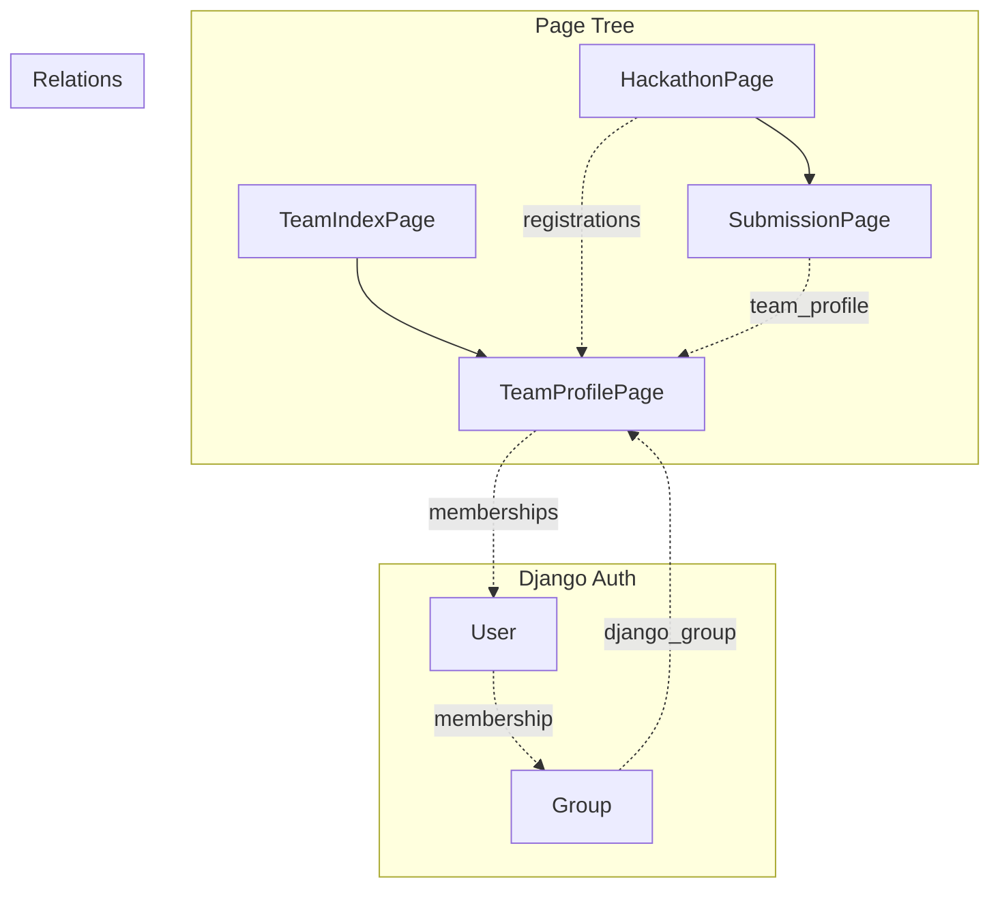

# 简化实现设计文档

## 概述

本文档描述了 Synnovator 平台中团队管理和项目提交功能的简化实现方案。该方案充分利用 Wagtail CMS 和 Django 权限系统的现有能力，实现最小化的代码改动和最大化的功能复用。

## 核心设计原则

1. **利用 Wagtail 页面树** - 将 Submission 和 TeamProfile 作为 Wagtail Page，利用页面树的父子关系表达归属关系
2. **利用 Django Group** - 通过 Django 原生的 Group 权限系统管理团队成员权限
3. **利用 InlinePanel** - 使用 Wagtail 的 InlinePanel 扩展内容类型

---

## 架构设计

### 1. SubmissionPage（项目提交页面）

**设计理念**：将提交内容作为 Wagtail Page，支持通过 StreamField 添加多种内容类型。

```python
class SubmissionPage(Page):
    """
    项目提交页面，作为 HackathonPage 的子页面存在。
    提交到某个 Hackathon = 在该 HackathonPage 下创建 SubmissionPage 子页面
    """

    # 必填：提交者（团队或个人）
    team_profile = ForeignKey('TeamProfilePage')  # 关联团队

    # 项目基本信息
    tagline = CharField(max_length=500)

    # 可扩展内容（通过 StreamField）
    content = StreamField([
        ('document', DocumentBlock()),      # Markdown 文档
        ('image', ImageChooserBlock()),     # 图片
        ('video', URLBlock()),              # 视频链接
        ('github_repo', URLBlock()),        # GitHub 仓库链接
        ('demo_url', URLBlock()),           # Demo 链接
        ('rich_text', RichTextBlock()),     # 富文本
    ])

    # 页面结构
    parent_page_types = ['hackathons.HackathonPage']
```

**关键行为**：
- `submit_to_hackathon(hackathon)` = 在 hackathon 页面下创建 SubmissionPage 子页面
- 管理员可通过 Wagtail Admin 添加新的 Block 类型
- 验证状态和评分通过 InlinePanel 管理

---

### 2. TeamProfilePage（团队主页）

**设计理念**：团队主页作为 Wagtail Page，创建团队时同时创建对应的 Django Group。

```python
class TeamProfilePage(Page):
    """
    团队主页，展示团队信息和成员。
    创建团队 = 创建 TeamProfilePage + 创建同名 Django Group
    """

    # 自动创建的关联 Group
    django_group = ForeignKey('auth.Group', editable=False)

    # 团队信息
    tagline = CharField(max_length=500)
    logo = ForeignKey('images.CustomImage')

    # 成员列表（通过 InlinePanel）
    # 加入团队 = 添加 TeamMembership + 将用户加入 Group

    # 内容区域
    body = StreamField([...])

    # 页面结构
    parent_page_types = ['community.TeamIndexPage']
```

**关键行为**：
- `create_team(name, leader)`:
  1. 创建 TeamProfilePage
  2. 创建 Django Group（名称=`team_{slug}`）
  3. 将创建者设为 Leader 并加入 Group

- `join_team(user, role)`:
  1. 创建 TeamMembership 关联
  2. 将用户加入 Django Group

---

### 3. 注册参加 Hackathon

**设计理念**：报名 = 在 HackathonPage 和 TeamProfilePage 之间建立关联。

```python
class HackathonRegistration(Orderable):
    """
    Hackathon 报名记录，作为 HackathonPage 的 InlinePanel 存在。
    报名 = 添加一条指向 TeamProfilePage 的记录
    """
    hackathon = ParentalKey('HackathonPage', related_name='registrations')
    team_profile = ForeignKey('TeamProfilePage')
    status = CharField(choices=[...])
    registered_at = DateTimeField(auto_now_add=True)
```

**关键行为**：
- `register_for_hackathon(hackathon, team_profile)`:
  1. 创建 HackathonRegistration 关联
  2. 团队获得向该 Hackathon 提交内容的权限

---

## 数据模型关系图



---

## 权限模型

| 操作 | 权限检查 |
|------|----------|
| 创建团队 | 已登录用户 |
| 编辑团队主页 | 用户在团队 Group 中 |
| 邀请成员 | 用户是团队 Leader |
| 加入团队 | 已登录用户 + 团队接受新成员 |
| 报名 Hackathon | 用户是团队成员 + Hackathon 开放注册 |
| 提交项目 | 用户在团队 Group 中 + 团队已报名 |
| 编辑提交 | 用户在团队 Group 中 |

---

## 实现优先级

### P0 - MVP 核心
1. [x] SubmissionPage 模型
2. [x] TeamProfilePage 模型（含 Group 集成）
3. [x] HackathonRegistration（团队报名）
4. [x] 基础视图：创建团队、加入团队、报名、提交

### P1 - 基础功能
1. [ ] 团队成员管理 UI
2. [ ] 提交内容编辑
3. [ ] 验证状态流转

### P2 - 高级功能
1. [ ] 团队邀请系统
2. [ ] 成员角色分配
3. [ ] 提交版本历史

---

## 与现有系统的兼容性

### 保留的模型
- `Quest` - 保持不变，继续使用 Snippet 模式
- `User` - 保持不变，新增与 TeamProfilePage 的关联
- `HackathonPage` - 添加新的 subpage_types 和 InlinePanel

### 废弃的模型
- 原有 `Team` 模型 → 迁移到 `TeamProfilePage`
- 原有 `TeamMember` 模型 → 迁移到 `TeamMembership`（使用 Group）
- 原有 `Submission` 模型（非 Page）→ 部分功能迁移到 `SubmissionPage`

### 数据迁移策略
1. 保留原有模型，标记为 deprecated
2. 新功能使用新模型
3. 逐步迁移历史数据

---

## 实现详情

### 文件结构

```
synnovator/
├── community/
│   ├── models/
│   │   ├── __init__.py
│   │   └── team.py          # TeamProfilePage, TeamMembership
│   └── views.py              # 团队管理视图
├── hackathons/
│   ├── models/
│   │   ├── hackathon.py      # 更新 HackathonPage
│   │   └── submission.py     # 更新为 SubmissionPage
│   └── views.py              # 更新提交和注册视图
```

---

## API 端点设计

| 端点 | 方法 | 描述 |
|------|------|------|
| `/api/teams/` | POST | 创建团队 |
| `/api/teams/<slug>/join/` | POST | 加入团队 |
| `/api/teams/<slug>/members/` | GET/POST/DELETE | 成员管理 |
| `/api/hackathons/<slug>/register/` | POST | 团队报名 |
| `/api/hackathons/<slug>/submit/` | POST | 提交项目 |

---

## 测试计划

### 单元测试
- TeamProfilePage 创建时自动创建 Group
- 加入团队时正确添加 Group 成员
- 提交项目创建正确的父子页面关系
- 权限检查正确执行

### 集成测试
- 完整流程：创建团队 → 加入成员 → 报名 → 提交
- 权限边界测试

---

## 总结

此简化设计的核心优势：
1. **利用 Wagtail 原生能力** - Page 树、StreamField、InlinePanel
2. **利用 Django 原生能力** - Group 权限系统
3. **可扩展性** - 管理员可通过 Admin 添加新内容类型
4. **简单性** - 最小化自定义代码
